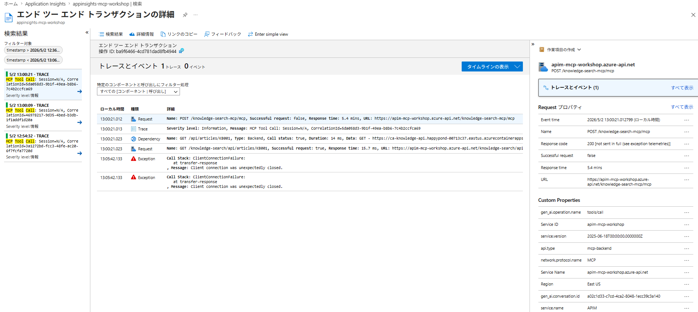
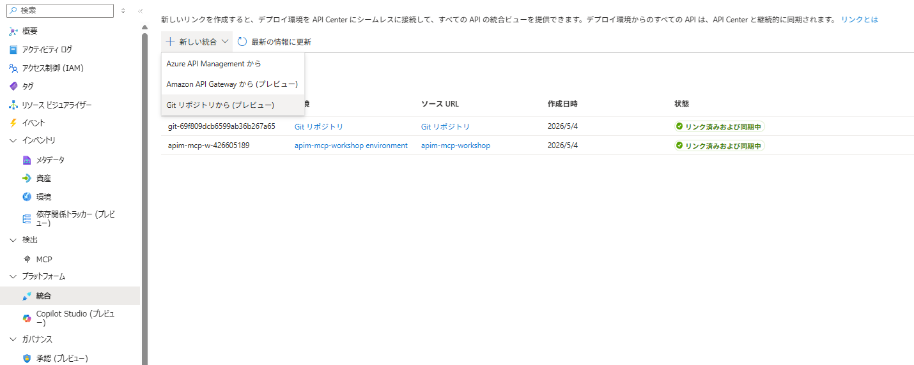
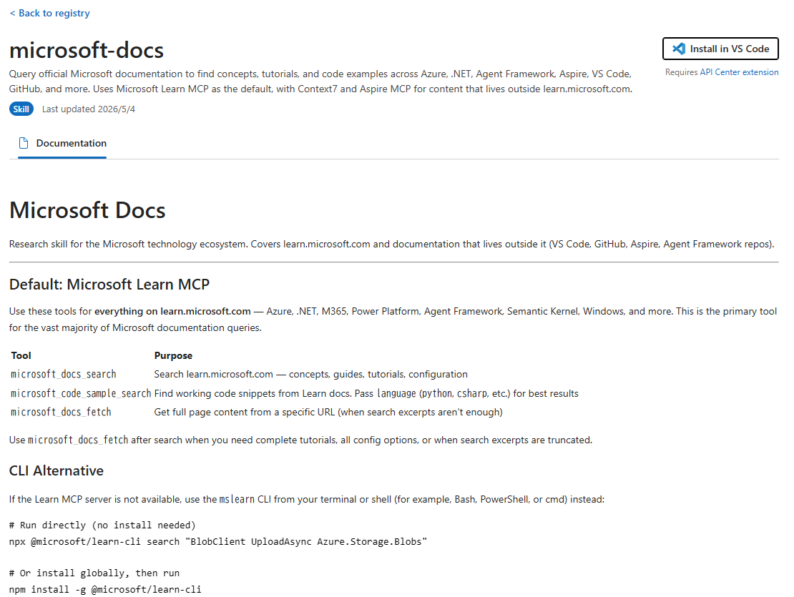
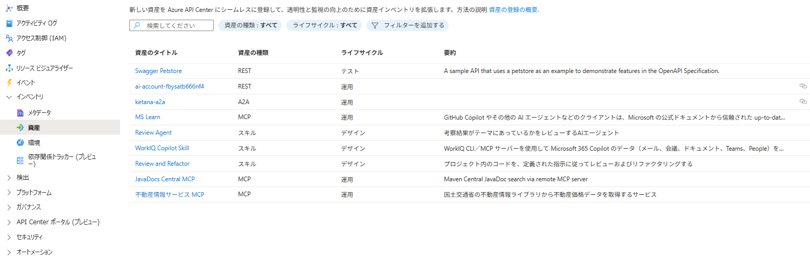
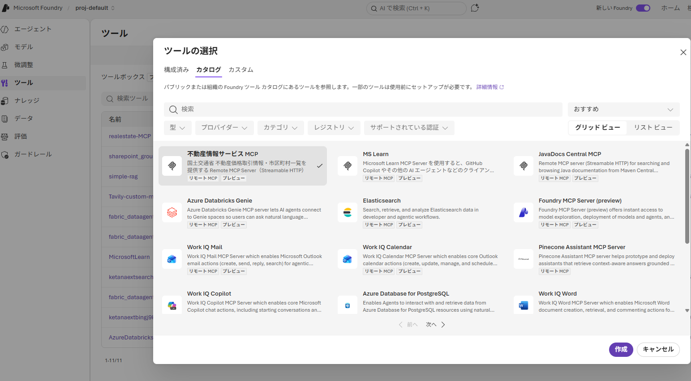

# Azure API Management × API Center × MCP ハンズオンワークショップ

## 「AIエージェント基盤-MCP関連の構築」

> **レベル**: L300（中級～上級）  
> **所要時間**: コア約5時間45分 ＋ オプション1時間  
> **最終更新**: 2026-04-30

---

## 📋 目次

- [ワークショップ概要](#ワークショップ概要)
- [前提条件](#前提条件)
- [全体アーキテクチャ](#全体アーキテクチャ)
- [Lab 0: 環境構築・アーキテクチャ概観（30分）](#lab-0-環境構築アーキテクチャ概観30分)
- [Lab 1: REST API を MCP Server として公開（60分）](#lab-1-rest-api-を-mcp-server-として公開60分)
- [Lab 2: 既存 MCP Server を APIM 経由で公開（60分）](#lab-2-既存-mcp-server-を-apim-経由で公開60分)
- [Lab 3: 認証・認可 — ユーザー代理実行とサービスID実行（60分）](#lab-3-認証認可--ユーザー代理実行とサービスid実行60分)
- [Lab 4: ガバナンス・レート制限・監査ログ（60分）](#lab-4-ガバナンスレート制限監査ログ60分)
- [Lab 5: API Center で MCP Server Registry を構築（45分）](#lab-5-api-center-で-mcp-server-registry-を構築45分)
- [Lab 6: API Center で Skill を登録（30分）](#lab-6-api-center-で-skill-を登録30分)
- [Lab 7: API Center Portal で MCP Server を発見（25分）](#lab-7-api-center-portal-で-mcp-server-を発見25分)
- [補足1: API Center 登録資産を Microsoft Foundry のプライベートカタログとして活用](#補足1-api-center-登録資産を-microsoft-foundry-のプライベートカタログとして活用)
- [対象者別 学習パス](#対象者別-学習パス)
- [参考資料](#参考資料)

---

## ワークショップ概要

### テーマ

任意のAIエージェント（このワークショップでは、社内ITサービスデスクで利用されるAIエージェント）が、**Remote MCP Server**(このワークショップでは、**社内ナレッジ検索**・**障害チケット起票**・**オンコール確認**など)の業務ツールに安全にアクセスできる基盤を、Azure API Management（APIM）と API Center を使って構築します。

### 学習目標

このワークショップを完了すると、以下ができるようになります。

1. REST API を APIM で MCP Server（Tool）として公開する
2. 既存の MCP Server を APIM の背後に配置しガバナンスを適用する
3. Entra ID を使った認証・認可ポリシーを設計・実装する
4. MCP Gateway のレート制限・監査ログ・相関IDを設定する
5. API Center を MCP Server Registry として構成し、メタデータを標準化する
6. VS Code / GitHub Copilot の Agent mode から MCP Server を利用する

### ビジネスシナリオ

```
あなたは社内プラットフォームチームのエンジニアです。
各業務チームが開発したAPIやMCP Serverを、
AIエージェントが安全に利用できるよう基盤を整備する任務を負っています。

今回のワークショップでは、以下の3つの業務システムを対象とします。

  📚 Knowledge Search API   — 社内ナレッジベースの検索（REST API）
  🎫 Incident MCP Server   — 障害チケットの参照・起票（既存MCP Server）
  📞 On-call Schedule API   — 当番表の参照（REST API）
```

---

## 前提条件

### 参加者の前提知識

| 区分 | 内容 |
|---|---|
| **必須** | Azure portal 基本操作、REST / JSON の基礎、OAuth 2.0 / Entra ID の概念理解 |
| **推奨** | APIM policy XML の読み書き、VS Code / GitHub Copilot の利用経験、Azure CLI / Bicep の基本 |

### 必要なソフトウェア

```
- Azure CLI 2.60 以上
- Node.js 20 以上 または Python 3.11 以上
- VS Code + GitHub Copilot 拡張機能
- MCP Inspector（公式デバッグツール）
- Git
```

### 必要な Azure リソース

| リソース | SKU | 用途 | 概算コスト |
|---|---|---|---|
| Azure API Management | Developer | MCP Gateway | 無料 |
| Azure API Center | Free | MCP Server Registry | 無料 |
| Azure Container Apps | Consumption | MCP Server / バックエンド API ホスト | $5〜$20/月 |
| Azure Container Registry | Basic | コンテナイメージ管理・ビルド | $5〜$10/月 |
| Microsoft Entra ID | Free Tier | OAuth 2.0 認証基盤 | 無料 |
| Application Insights | Pay-as-you-go | 監査ログ・トレーシング | $5〜$15/月 |
| Log Analytics Workspace | Pay-as-you-go | KQL クエリ基盤 | 上記に含む |
| Azure Key Vault | Standard | シークレット管理 | $1〜$5/月 |

### 必要な Azure 権限

```
- Contributor（リソースグループスコープ）
- API Management Service Contributor
- API Center Owner（API Center リソーススコープ）
- Application Administrator（Entra ID アプリ登録用）
```

---

## 全体アーキテクチャ

本ワークショップで構築するシステムの全体像です。

```
┌────────────────────────────────────────────────────────────────┐
│  利用者 / AIエージェント層                                      │
│                                                                │
│  VS Code + GitHub Copilot (Agent Mode)                         │
│  └─ MCP Client として APIM 経由で業務ツールを呼び出す           │
└───────────────────────┬────────────────────────────────────────┘
                        │ Streamable HTTP (JSON-RPC 2.0)
                        ↓
┌────────────────────────────────────────────────────────────────┐
│  Azure API Management — MCP Gateway                            │
│                                                                │
│  ┌──────────┐ ┌──────────┐ ┌──────────┐ ┌──────────────────┐ │
│  │認証・認可 │ │レート制限 │ │Origin検証│ │監査ログ          │ │
│  │Entra ID  │ │Session別 │ │DNS対策   │ │App Insights      │ │
│  │OAuth 2.1 │ │Token別   │ │          │ │Azure Monitor     │ │
│  └──────────┘ └──────────┘ └──────────┘ └──────────────────┘ │
│                                                                │
│  ┌─────────────────────┐  ┌──────────────────────────────────┐│
│  │ REST API → MCP化    │  │ 既存 MCP Server を Expose        ││
│  │ (Knowledge Search)  │  │ (Incident MCP Server)            ││
│  │ (On-call Schedule)  │  │                                  ││
│  └─────────────────────┘  └──────────────────────────────────┘│
└───────────────────────┬──────────────┬─────────────────────────┘
                        │              │
           ┌────────────┘              └────────────┐
           ↓                                        ↓
┌──────────────────────┐              ┌──────────────────────┐
│  Container Apps      │              │  Container Apps      │
│  Knowledge Search API│              │  Incident MCP Server │
│  On-call Schedule API│              │  (Streamable HTTP)   │
│  (REST)              │              │                      │
└──────────────────────┘              └──────────────────────┘
           ↑                                        ↑
           └──────────────┬─────────────────────────┘
                          │ イメージ pull
┌─────────────────────────┴──────────────────────────────────────┐
│  Azure Container Registry (ACR) — Basic SKU                    │
│                                                                │
│  knowledge-api / incident-mcp / oncall-api イメージを管理       │
│  az acr build でサーバーサイドビルド（Docker Desktop 不要）      │
└────────────────────────────────────────────────────────────────┘

┌────────────────────────────────────────────────────────────────┐
│  Azure API Center — MCP Server Registry                        │
│                                                                │
│  ┌──────────────┐ ┌────────────┐ ┌────────────┐ ┌──────────┐ │
│  │MCP Server    │ │メタデータ   │ │APIM        │ │ポータル   │ │
│  │インベントリ   │ │標準化      │ │自動同期    │ │公開      │ │
│  └──────────────┘ └────────────┘ └────────────┘ └──────────┘ │
└────────────────────────────────────────────────────────────────┘
```

---

## Lab 0: 環境構築・アーキテクチャ概観（30分）

### 🎯 目的

ワークショップで使用する Azure リソースをデプロイし、全体アーキテクチャを理解します。

### 📖 概要説明（10分）

#### MCP（Model Context Protocol）とは

MCP は AI エージェントが外部システムと接続するためのオープン標準プロトコルです。3つの基本要素（プリミティブ）で構成されます。

| プリミティブ | 役割 | 例 |
|---|---|---|
| **Tools** | エージェントが実行する関数 | ナレッジ検索、チケット起票 |
| **Resources** | コンテキストを提供するデータ | ドキュメント、DB レコード |
| **Prompts** | 再利用可能な対話テンプレート | 障害対応プロンプト |

#### APIM と API Center の役割分担

| コンポーネント | 役割 | 担当領域 |
|---|---|---|
| **Azure API Management** | ランタイムガバナンス（Gateway） | 認証、レート制限、監査ログ、ルーティング |
| **Azure API Center** | デザインタイムガバナンス（Registry） | MCP Server登録、メタデータ、カタログ、発見 |

> **💡 ポイント**: APIM は「MCP Server を**安全に動かす**」、API Center は「MCP Server を**見つけて管理する**」役割です。

### 🔨 ハンズオン：環境デプロイ（20分）

#### Step 1: リポジトリのクローン

```powershell
git clone https://github.com/ketana0224/MCP-Gateway-handson.git
cd MCP-Gateway-handson
```

#### Step 2: Azure にログイン

```powershell
az login
az account set --subscription "<your-subscription-id>"
```

#### Step 3: リソースプロバイダーの登録

新規サブスクリプションでは、以下のリソースプロバイダーを事前に登録してください。

```powershell
az provider register -n Microsoft.App --wait
az provider register -n Microsoft.ApiManagement --wait
az provider register -n Microsoft.ApiCenter --wait
az provider register -n Microsoft.KeyVault --wait
az provider register -n Microsoft.Insights --wait
az provider register -n Microsoft.OperationalInsights --wait
```

> **⏱️ 注意**: 登録には数分かかります。`--wait` を付けることで完了まで待機します。

#### Step 4: リソースグループの作成

```powershell
az group create `
  --name rg-mcp-workshop `
  --location japaneast
```

#### Step 4: Bicep テンプレートでリソースをデプロイ

```powershell
az deployment group create `
  --resource-group rg-mcp-workshop `
  --template-file infra/main.bicep `
  --parameters infra/parameters.json
```

> **⏱️ 注意**: APIM Developer SKU のプロビジョニングには約15～20分かかります。デプロイ開始後、次のセクションの座学に進んでください。

#### Step 5: コンテナイメージのビルドと Container Apps へのデプロイ

Bicep デプロイで作成された Azure Container Registry (ACR) にイメージをビルドし、Container Apps を更新します。

```powershell
# デプロイ outputs から ACR 名を取得
$ACR_NAME = az deployment group show `
  -g rg-mcp-workshop -n main `
  --query "properties.outputs.acrName.value" -o tsv
$ACR_SERVER = az deployment group show `
  -g rg-mcp-workshop -n main `
  --query "properties.outputs.acrLoginServer.value" -o tsv

Write-Host "ACR: $ACR_SERVER"

# ACR 上でサーバーサイドビルド（ローカルに Docker 不要）
az acr build --registry $ACR_NAME `
  --image "knowledge-api:latest" src/knowledge-api/

az acr build --registry $ACR_NAME `
  --image "incident-mcp:latest" src/incident-mcp-server/

az acr build --registry $ACR_NAME `
  --image "oncall-api:latest" src/oncall-api/

# ACR 認証情報を取得して Container Apps を更新
$ACR_USERNAME = az acr credential show --name $ACR_NAME --query "username" -o tsv
$ACR_PASSWORD = az acr credential show --name $ACR_NAME --query "passwords[0].value" -o tsv

az containerapp update `
  --name ca-knowledge-api --resource-group rg-mcp-workshop `
  --image "$ACR_SERVER/knowledge-api:latest" `
  --registry-server $ACR_SERVER `
  --registry-username $ACR_USERNAME `
  --registry-password $ACR_PASSWORD

az containerapp update `
  --name ca-incident-mcp --resource-group rg-mcp-workshop `
  --image "$ACR_SERVER/incident-mcp:latest" `
  --registry-server $ACR_SERVER `
  --registry-username $ACR_USERNAME `
  --registry-password $ACR_PASSWORD

az containerapp update `
  --name ca-oncall-api --resource-group rg-mcp-workshop `
  --image "$ACR_SERVER/oncall-api:latest" `
  --registry-server $ACR_SERVER `
  --registry-username $ACR_USERNAME `
  --registry-password $ACR_PASSWORD
```

> **💡 ポイント**: `az acr build` はクラウド側でビルドするため、ローカルに Docker Desktop が不要です。

#### Step 6: デプロイ結果の確認

```powershell
# APIM エンドポイントの確認
az apim show --name apim-mcp-workshop --resource-group rg-mcp-workshop `
  --query "gatewayUrl" -o tsv

# ACR の確認
az acr show --name $ACR_NAME --resource-group rg-mcp-workshop `
  --query "loginServer" -o tsv

# API Center の確認
az apic show --name apic-mcp-workshop --resource-group rg-mcp-workshop `
  --query "id" -o tsv

# Application Insights の確認
az monitor app-insights component show `
  --app appinsights-mcp-workshop --resource-group rg-mcp-workshop `
  --query "instrumentationKey" -o tsv
```

### ✅ 確認ポイント

- [ ] APIM ゲートウェイ URL にアクセスして応答を確認
- [ ] ACR にイメージ（knowledge-api, incident-mcp, oncall-api）が存在する
- [ ] Container Apps 3つが実イメージで稼働している（`/health` が `{"status":"ok"}` を返す）
- [ ] Azure Portal で API Center リソースが表示される
- [ ] Application Insights のインストルメンテーションキーを取得

### 📦 成果物

| 成果物 | 内容 |
|---|---|
| デプロイ済み環境 | APIM / API Center / Container Apps / ACR / App Insights |
| パラメータファイル | `infra/parameters.json` |
| 接続情報メモ | APIM URL / ACR Login Server / API Center ID / App Insights Key |

---

## Lab 1: REST API を MCP Server として公開（60分）

### 🎯 目的

既存の REST API を APIM で MCP Server（Tool）として公開する方法を学びます。

### 📖 概要説明（10分）

APIM には **REST API を MCP Server として公開する機能** があります。API の各オペレーション（GET /articles, POST /search 等）が MCP の **Tool** として自動的にマッピングされます。

```
REST API Operation          →    MCP Tool
──────────────────────           ──────────────
GET  /articles/{id}         →    getArticle
POST /articles/search       →    searchArticles
GET  /categories            →    listCategories
```

> **⚠️ 制約**: REST API → MCP 変換では **Tools のみ対応** です（Resources / Prompts は非対応）。

### 🔨 ハンズオン（50分）

#### Step 1: Knowledge Search API のデプロイ確認（5分）

Lab 0 で Knowledge Search API が Container Apps にデプロイされていることを確認します。

```powershell
# Knowledge Search API の URL を取得
$KNOWLEDGE_API_URL = az containerapp show `
  --name ca-knowledge-api `
  --resource-group rg-mcp-workshop `
  --query "properties.configuration.ingress.fqdn" -o tsv

# 動作確認
curl https://$KNOWLEDGE_API_URL/api/categories
```

期待される応答:
```json
[
  {"id": "infra", "name": "インフラストラクチャ"},
  {"id": "security", "name": "セキュリティ"},
  {"id": "network", "name": "ネットワーク"}
]
```

#### Step 2: APIM に Knowledge Search API をインポート（5分）

```powershell
# OpenAPI 定義をインポート
az apim api import `
  --resource-group rg-mcp-workshop `
  --service-name apim-mcp-workshop `
  --api-id knowledge-search `
  --path knowledge-search `
  --specification-format OpenApiJson `
  --specification-url "https://$KNOWLEDGE_API_URL/api/openapi.json" `
  --display-name "Knowledge Search API" `
  --service-url "https://$KNOWLEDGE_API_URL" `
  --subscription-required false
```

Azure Portal で確認:
1. **API Management** → **APIs** → **Knowledge Search API** を開く
2. 各オペレーション（searchArticles, listCategories, getArticle）が表示されることを確認

#### Step 3: knowledge-search-mcp として公開（10分）

Azure Portal での操作:

1. **API Management** → **APIs** → **MCP Servers** を開く
2. **+ Create MCP server** をクリック
3. **API を MCP サーバーとして公開する（Expose an API as an MCP server）** を選択

**バックエンド MCP サーバー** セクション:

4. **API** で `Knowledge Search API` を選択
5. **API 操作** で公開する Operations（= Tools）を選択:
   - ✅ `[POST] searchArticles`
   - ✅ `[GET] listCategories`
   - ✅ `[GET] getArticle`

**新しい MCP サーバー** セクション:

6. 以下を入力:

| フィールド | 値 |
|---|---|
| Display name | `knowledge-search-mcp` |
| Name | `knowledge-search-mcp` |
| 説明 | `社内ナレッジベースを検索するMCP Server。記事の全文検索、カテゴリ別一覧、個別記事の取得が可能。` |

**製品** セクション:

7. 製品は任意（空のままでも可）

8. **作成** をクリック

9. 作成が完了したら、`mcpProperties`（MCP エンドポイントの uriTemplate）を設定する:

```powershell
$sub = az account show --query id -o tsv
$t = az account get-access-token --resource https://management.azure.com/ --query accessToken -o tsv
$h = @{ Authorization="Bearer $t"; "Content-Type"="application/json" }
$body = '{"properties":{"mcpProperties":{"endpoints":{"mcp":{"uriTemplate":"/mcp"}}}}}'
Invoke-RestMethod "https://management.azure.com/subscriptions/$sub/resourceGroups/rg-mcp-workshop/providers/Microsoft.ApiManagement/service/apim-mcp-workshop/apis/knowledge-search-mcp?api-version=2025-03-01-preview" -Method PATCH -Headers $h -Body $body | Out-Null
Write-Host "knowledge-search-mcp : mcpProperties 設定完了"
```

> **ℹ️ この手順について**: 「Expose an API as an MCP server」フローはポータル UI でのみ実行可能なプレビュー機能ですが、現時点では `mcpProperties`（MCP エンドポイントの URL template）が未設定のまま API が作成されます。この PATCH はその不足を補う**作成完了の必須手順**です。`incident-mcp`（Lab 2）が使う「Expose an existing MCP server」フローは `mcpProperties` を正しく設定するため、同様の操作は不要です。

> **💡 ポイント**: Tool の名前と説明文は、LLM がツール選択に使います。わかりやすい説明を書くことが重要です。

#### Step 4: On-call Schedule API のデプロイ確認（5分）

同様の手順で On-call Schedule API も MCP Server として公開します。

```powershell
# On-call Schedule API の URL を取得
$ONCALL_API_URL = az containerapp show `
  --name ca-oncall-api `
  --resource-group rg-mcp-workshop `
  --query "properties.configuration.ingress.fqdn" -o tsv

# 動作確認
curl https://$ONCALL_API_URL/api/oncall/2026-04-30
```

期待される応答:
```json
{"date": "2026-04-30", "primary": "佐藤次郎", "secondary": "鈴木花子", "team": "インフラチーム"}
```

#### Step 5: APIM に Oncall Schedule API をインポート（5分）

```powershell
# OpenAPI 定義をインポート
az apim api import `
  --resource-group rg-mcp-workshop `
  --service-name apim-mcp-workshop `
  --api-id oncall-schedule `
  --path oncall `
  --specification-format OpenApiJson `
  --specification-url "https://$ONCALL_API_URL/api/openapi.json" `
  --display-name "Oncall Schedule API" `
  --service-url "https://$ONCALL_API_URL" `
  --subscription-required false
```

Azure Portal で確認:
1. **API Management** → **APIs** → **Oncall Schedule API** を開く
2. 各オペレーション（getCurrentOncall, getScheduleByDate）が表示されることを確認

#### Step 6: oncall-schedule-mcp として公開（10分）

Azure Portal での操作:

1. **API Management** → **APIs** → **MCP Servers** を開く
2. **+ Create MCP server** をクリック
3. **API を MCP サーバーとして公開する（Expose an API as an MCP server）** を選択

**バックエンド MCP サーバー** セクション:

4. **API** で `Oncall Schedule API` を選択
5. **API 操作** で公開する Operations（= Tools）を選択:
   - ✅ `[GET] getCurrentOncall`
   - ✅ `[GET] getScheduleByDate`

**新しい MCP サーバー** セクション:

6. 以下を入力:

| フィールド | 値 |
|---|---|
| Display name | `oncall-schedule-mcp` |
| Name | `oncall-schedule-mcp` |
| 説明 | `オンコール当番スケジュール参照用 MCP Server。現在の担当者取得と日付指定での担当者検索が可能。` |

**製品** セクション:

7. 製品は任意（空のままでも可）

8. **作成** をクリック

9. 作成が完了したら、`mcpProperties`（MCP エンドポイントの uriTemplate）を設定する:

```powershell
$sub = az account show --query id -o tsv
$t = az account get-access-token --resource https://management.azure.com/ --query accessToken -o tsv
$h = @{ Authorization="Bearer $t"; "Content-Type"="application/json" }
$body = '{"properties":{"mcpProperties":{"endpoints":{"mcp":{"uriTemplate":"/mcp"}}}}}'
Invoke-RestMethod "https://management.azure.com/subscriptions/$sub/resourceGroups/rg-mcp-workshop/providers/Microsoft.ApiManagement/service/apim-mcp-workshop/apis/oncall-schedule-mcp?api-version=2025-03-01-preview" -Method PATCH -Headers $h -Body $body | Out-Null
Write-Host "oncall-schedule-mcp : mcpProperties 設定完了"
```

> **ℹ️ この手順について**: Step 3 と同様、「Expose an API as an MCP server」プレビュー機能の制限により `mcpProperties` が未設定で作成されます。この PATCH は**作成完了の必須手順**です。

> **💡 ポイント**: Tool の説明文（`mcpTools[].description`）は Operation の displayName から自動生成されます。バックエンド API の OpenAPI `summary` を日本語にしておくことで、MCP Server 作成時から日本語説明が設定されます。

#### Step 7: 認証方針の確認（2分）

MCP Server を Portal から作成すると、デフォルトで**サブスクリプション不要**の設定になっています。このワークショップでは **Entra ID（OAuth 2.0）を認証レイヤー** として使用するため、サブスクリプションキーは設定しません。

> **💡 認証設計方針**: Lab 3 で Entra ID ポリシーを設定します。これにより API Center Portal（Lab 7）からサインイン済みの Bearer トークンが自動送信され、ツール呼び出しが可能になります。サブスクリプションキーを別途管理する必要はありません。

#### Step 8: MCP Inspector で動作確認（10分）

```powershell
# MCP Inspector を起動
npx @modelcontextprotocol/inspector
```

MCP Inspector の接続設定:
```
Transport: Streamable HTTP
URL: https://apim-mcp-workshop.azure-api.net/knowledge-search-mcp/mcp
```

> **💡 ポイント**: Lab 1 では認証なしで接続します（APIM の MCP Server 作成直後はサブスクリプション不要がデフォルト）。Lab 3 で Entra ID 認証ポリシーを設定した後は `Authorization: Bearer <token>` ヘッダーが必要になります。

確認手順（knowledge-search-mcp）:
1. **Connect** → 接続成功を確認
2. **Tools** タブ → 3つのツール（searchArticles, getArticle, listCategories）が表示される
3. `searchArticles` を選択 → パラメータに `{"query": "VPN"}` を入力 → **Call Tool**
4. レスポンスにナレッジ記事が返ることを確認

確認手順（oncall-schedule-mcp）:
1. URL を `https://apim-mcp-workshop.azure-api.net/oncall-schedule-mcp/mcp` に変更して **Connect**
2. **Tools** タブ → 2つのツール（getCurrentOncall, getScheduleByDate）が表示される
3. `getCurrentOncall` を選択 → **Call Tool**
4. レスポンスにオンコール担当者情報が返ることを確認

### ✅ 確認ポイント

- [ ] Knowledge Search API が APIM にインポートされている（3 オペレーション）
- [ ] Oncall Schedule API が APIM にインポートされている（2 オペレーション）
- [ ] curl で `https://apim-mcp-workshop.azure-api.net/knowledge-search-mcp/mcp` に `tools/list` が返る
- [ ] `tools/list` で `searchArticles` / `getArticle` / `listCategories` の 3 ツールが返る
- [ ] `searchArticles` でキーワード検索結果が返る
- [ ] curl で `https://apim-mcp-workshop.azure-api.net/oncall-schedule-mcp/mcp` に `tools/list` が返る
- [ ] `tools/list` で `getCurrentOncall` / `getScheduleByDate` の 2 ツールが返る

### 📦 成果物

| 成果物 | 内容 |
|---|---|
| Knowledge Search MCP endpoint | `https://apim-mcp-workshop.azure-api.net/knowledge-search-mcp/mcp` |
| Knowledge Search Tool 一覧 | `searchArticles` / `getArticle` / `listCategories` |
| Oncall Schedule MCP endpoint | `https://apim-mcp-workshop.azure-api.net/oncall-schedule-mcp/mcp` |
| Oncall Schedule Tool 一覧 | `getCurrentOncall` / `getScheduleByDate` |
| 実行確認 | curl による tools/list レスポンス |

---

## Lab 2: 既存 MCP Server を APIM 経由で公開（60分）

### 🎯 目的

既に MCP プロトコルに対応しているサーバーを APIM の背後に配置し、ガバナンスを一元化する方法を学びます。

### 📖 概要説明（10分）

Lab 1 では REST API を MCP 化しましたが、チームによっては **最初から MCP Server として開発** しているケースがあります。その場合、APIM の **Expose an existing MCP server** 機能を使います。

```
Lab 1: REST API ──[APIM変換]──→ MCP Server（tools only）
Lab 2: MCP Server ──[APIMプロキシ]──→ MCP Server（tools + resources）
```

> **💡 ポイント**: 既存 MCP Server を APIM 経由にする場合、**Tools と Resources** の両方が利用可能です（Prompts は非対応）。

> **⚠️ 要件**: 既存 MCP Server は **MCP version 2025-06-18 以降** に準拠し、**Streamable HTTP** をサポートする必要があります。

### 🔨 ハンズオン（50分）

#### Step 1: Incident MCP Server のデプロイ確認（10分）

```powershell
# Incident MCP Server の URL を取得して表示
$INCIDENT_MCP_URL = az containerapp show `
  --name ca-incident-mcp `
  --resource-group rg-mcp-workshop `
  --query "properties.configuration.ingress.fqdn" -o tsv
Write-Host "Incident MCP URL: https://$INCIDENT_MCP_URL/mcp"
```

出力例:
```
Incident MCP URL: https://ca-incident-mcp.happypond-00713c37.eastus.azurecontainerapps.io/mcp
```

上記の URL をコピーしてから MCP Inspector を起動します:
```powershell
npx @modelcontextprotocol/inspector
```

直接接続の設定（コピーした URL を貼り付け）:
```
Transport: Streamable HTTP
URL: https://ca-incident-mcp.<環境固有パス>.azurecontainerapps.io/mcp
```

このサーバーが提供するツール:
| Tool | 説明 | 種別 |
|---|---|---|
| `listIncidents` | 障害チケット一覧取得 | 読み取り |
| `getIncident` | 障害チケット詳細取得 | 読み取り |
| `createIncident` | 障害チケット起票 | 書き込み（副作用あり） |

> **💡 気づきポイント**: この時点では**認証なし・レート制限なし・ログなし**です。次のステップで APIM を経由させることで、これらの課題を解決します。

#### Step 2: APIM で既存 MCP Server を公開（15分）

Azure Portal での操作:

1. **API Management** → **APIs** → **MCP Servers** → **+ Create MCP server**
2. **既存の MCP サーバーを公開する（Expose an existing MCP server）** を選択

**バックエンド MCP サーバー** セクション:

3. **MCP サーバーのベース URL** に入力（Step 1 で表示された URL）:
   ```
   https://ca-incident-mcp.<環境固有パス>.azurecontainerapps.io/mcp
   ```

**新しい MCP サーバー** セクション:

4. 以下を入力:

| フィールド | 値 |
|---|---|
| Display name | `incident-mcp` |
| Name | `incident-mcp` |
| ベース パス | `/incident-mcp` |
| 説明 | `障害チケット管理用MCP Server。チケットの参照、起票が可能。` |

**製品** セクション:

5. 製品は任意（空のままでも可）

6. **作成** をクリック

> **💡 ポイント**: Lab 3 で Entra ID 認証ポリシーを 3 つすべての MCP Server に適用します。それまでは認証なしで接続できます。

#### Step 3: APIM 経由での動作確認（10分）

> **⚠️ MCP Inspector は APIM エンドポイントに接続できません。** Inspector 0.10.x 以降は接続時に RFC 7591 Dynamic Client Registration (DCR) を自動実行しますが、APIM は DCR をサポートしていないためエラーになります。代わりに curl を使用します。

```powershell
$body = '{"jsonrpc":"2.0","id":1,"method":"tools/list","params":{}}'
$MCP_URL = "https://apim-mcp-workshop.azure-api.net/incident-mcp/mcp"

# tools/list → 3 つのツールが返ることを確認
curl.exe -s -X POST $MCP_URL `
  -H "Content-Type: application/json" `
  -H "Accept: application/json, text/event-stream" `
  -d $body | ForEach-Object { [System.Text.RegularExpressions.Regex]::Unescape($_) }
```

確認手順:
1. `tools/list` → `listIncidents` / `getIncident` / `createIncident` の 3 ツールが返る
2. `listIncidents` を呼び出し → チケット一覧が返る
3. 直接接続とAPIM経由の**レスポンス内容が同一**であることを確認

#### Step 4: 直接接続と APIM 経由の差分整理（15分）

以下の表を埋めて、APIM を経由するメリットを整理しましょう。

| 項目 | 直接接続 | APIM 経由 |
|---|---|---|
| URL | `https://<backend>/mcp` | `https://<apim>/incident-mcp/mcp` |
| 認証 | なし | なし（Lab 3 で Entra ID 認証を追加） |
| レート制限 | なし | 設定可能（Lab 4 で実装） |
| 監査ログ | なし | Azure Monitor / App Insights（Lab 4 で実装） |
| Origin 検証 | なし | ポリシーで設定可能 |
| IP 制限 | なし | ポリシーで設定可能 |

### ✅ 確認ポイント

- [ ] APIM 経由で Incident MCP Server のツールを呼び出せる
- [ ] 直接接続と APIM 経由のレスポンスが一致する
- [ ] APIM を経由するメリットを 3 つ以上説明できる

### 📦 成果物

| 成果物 | 内容 |
|---|---|
| APIM 経由 MCP URL | `https://apim-mcp-workshop.azure-api.net/incident-mcp/mcp` |
| 直接/APIM経由 比較表 | 認証・制限・ログの差分整理 |

---

## Lab 3: 認証・認可 — ユーザー代理実行とサービスID実行（60分）

### 🎯 目的

MCP Server へのアクセスに対して Entra ID ベースの認証・認可を設定し、ユーザー代理実行とサービスID実行の使い分けを学びます。

### 📖 概要説明（10分）

#### 2つの認証パターン

```
パターンA: ユーザー代理実行（User-delegated）
  利用者がログイン → トークンが APIM に渡される → バックエンドにユーザーIDが伝播
  → 「誰が」ツールを使ったかを追跡可能

パターンB: サービスID実行（Service Identity）
  APIM の Managed Identity で認証 → 全ユーザー共通のアクセス
  → M2M 通信、バッチ処理に適切
```

#### 使い分けの判断フロー

```
ユーザーのIDコンテキストが必要か？
├─ YES → ユーザーごとに異なるデータにアクセスするか？
│         ├─ YES → Credential Manager (user-delegated)
│         └─ NO  → Credential Manager (Attended) + ユーザー同意
└─ NO  → サービス間通信（ユーザー非依存）
           ├─ Azure リソース間 → Managed Identity
           └─ SaaS バックエンド → Credential Manager (Unattended)
```

#### 本ワークショップでの適用例

| ツール | 推奨認証パターン | 理由 |
|---|---|---|
| Knowledge Search | ユーザー代理 | 検索ログに「誰が検索したか」を残すため |
| Incident 起票 | ユーザー代理 | 「誰が起票したか」の記録が必須 |
| On-call 参照 | サービスID | 当番表は全員同一データ |

### 🔨 ハンズオン（50分）

#### Step 1: Entra ID アプリ登録（15分）

> **⏭️ スキップ条件（再実施・2回目以降の方）**: このステップは**一度きりの設定**です。同一テナントで既に実施済みの場合は以下で確認してスキップできます:
>
> ```powershell
> az ad app list --display-name "MCP Workshop Client" --query "[0].appId" -o tsv
> az ad app list --display-name "MCP Workshop Server" --query "[0].appId" -o tsv
> ```
>
> 両方の App ID が表示された場合は **Step 2（Named Values 設定）から再開**してください。

> **🔐 権限の整理**: このステップで必要な Entra ID 権限は以下の通りです。
>
> | 操作 | 必要な権限 |
> |---|---|
> | アプリの登録・表示・編集 | アプリのオーナー（作成者）であれば特別なロール不要 |
> | Application ID URI の設定 | アプリのオーナー |
> | oauth2PermissionScopes の追加 | アプリのオーナー |
> | 承認済みクライアントの追加 | アプリのオーナー |
> | **管理者の同意の付与** | **アプリケーション管理者（Application Administrator）以上** |
>
> 本ワークショップでは自分で作成したアプリを操作するため、アプリ登録・編集はオーナーとして行えます。管理者の同意付与のみ Application Administrator 以上が必要です（前提条件に記載）。

**MCP Client 用アプリ登録:**

> **� 役割**: MCP Inspector や Azure CLI (`az account get-access-token`) など「**ツールを呼び出す側**」を表す Entra ID アプリ。
> OAuth 2.0 フローで「ユーザーの代わりに MCP Server へのアクセストークンを取得」する。
> APIM は「この Client から発行されたトークン」であることを検証する。

1. [Azure Portal](https://portal.azure.com) → **Microsoft Entra ID** → **アプリの登録** → 「**+ 新規登録**」
2. 以下を入力して「**登録**」:

   | 項目 | 値 |
   |---|---|
   | 名前 | `MCP Workshop Client` |
   | サポートされているアカウントの種類 | **シングル テナントのみ**（`この組織ディレクトリのみ`と同義） |
   | リダイレクト URI | Web / `http://localhost:3000/callback` |

3. 登録後、「**概要**」→「**アプリケーション (クライアント) ID**」を記録しておく（後で `$CLIENT_APP_ID` として使用）

**MCP Server 用アプリ登録:**

> **📌 役割**: APIM の `validate-azure-ad-token` ポリシーが検証する「**トークンの宛先**」を表す Entra ID アプリ。
> `api://<SERVER_APP_ID>` が JWT の `aud`（audience）クレームと一致するか検証される。
> ユーザーは自らログインすることはなく、Client アプリがトークンを代理取得する。

1. 「**+ 新規登録**」
2. 以下を入力して「**登録**」:

   | 項目 | 値 |
   |---|---|
   | 名前 | `MCP Workshop Server` |
   | サポートされているアカウントの種類 | **シングル テナントのみ**（`この組織ディレクトリのみ`と同義） |
   | リダイレクト URI | （空のまま） |

3. 登録後、「**概要**」→「**アプリケーション (クライアント) ID**」を記録しておく（後で `$SERVER_APP_ID` として使用）

**① Application ID URI の設定**
1. `MCP Workshop Server` の左メニュー「**API の公開**」→ 画面上部「**追加**」（Application ID URI）
2. 既定値 `api://<appId>` のまま「**保存**」

**② スコープ（access_as_user）の追加**
1. 同じ「**API の公開**」画面 → 「**+ Scope の追加**」
2. 以下を入力して「**スコープの追加**」を押す

   | 項目 | 値 |
   |---|---|
   | スコープ名 | `access_as_user` |
   | 同意できるユーザー | **管理者とユーザー** |
   | 管理者の同意の表示名 | `access_as_user` |
   | 管理者の同意の説明 | `Access MCP Server as user` |
   | ユーザーの同意の表示名 | `access_as_user` |
   | ユーザーの同意の説明 | `Access MCP Server` |
   | 状態 | **有効** |

**③ Client アプリに Server スコープの利用許可を追加し、管理者の同意を付与**

Server アプリ自身は何も API を呼ばないため、Server の「API のアクセス許可」は**空で正常**です。
同意はアクセス許可を**使う側（Client アプリ）** から行います。

1. **Microsoft Entra ID** → **アプリの登録** → `MCP Workshop Client` を開く
2. 左メニュー「**API のアクセス許可**」→「**+ アクセス許可の追加**」
3. 右側パネルで「**所属する組織で使用している API**」タブをクリック
4. 検索ボックスに `MCP Workshop Server` と入力 → 候補に表示されたらクリック
5. 「**委任されたアクセス許可**」→ `access_as_user` にチェック → 「**アクセス許可の追加**」
6. 「**Contoso に管理者の同意を与えます**」ボタンをクリック → 「**はい**」

> **⚠️ 権限要件**: 管理者の同意付与には Entra ID で **アプリケーション管理者**（Application Administrator）以上のロールが必要です。ボタンがグレーアウトしている場合はロールが不足しています。テナント管理者に依頼するか、前提条件の権限を確認してください。

> **⚠️ 注意**: 手順 3 のタブ名は「自分の組織で使用している API」ではなく「**所属する組織で使用している API**」です（Portal の表記に注意）。

**④ Azure CLI を承認済みクライアントに追加（`az account get-access-token` でのテスト用）**
1. `MCP Workshop Server` → 「**API の公開**」
2. 「**承認済みのクライアント アプリケーション**」→「**+ クライアント アプリケーションの追加**」
3. 右パネルの「クライアント ID」欄（プレースホルダーに例の GUID が薄く表示されているが入力欄は空）に以下を入力:
   ```
   04b07795-8ddb-461a-bbee-02f9e1bf7b46
   ```
   > **💡 この GUID は Microsoft Azure CLI の固定 App ID**（すべてのテナント共通）。自分のアプリの ID ではありません。
4. 「承認済みのスコープ」の `api://.../access_as_user` にチェックが入っていることを確認 → 「**アプリケーションの追加**」

設定後、Client / Server の App ID を変数に記録します:

```powershell
$CLIENT_APP_ID = az ad app list --display-name "MCP Workshop Client" `
  --query "[0].appId" -o tsv
$SERVER_APP_ID = az ad app list --display-name "MCP Workshop Server" `
  --query "[0].appId" -o tsv
Write-Host "Client App ID: $CLIENT_APP_ID"
Write-Host "Server App ID: $SERVER_APP_ID"
```

#### Step 2: APIM の Named Values を設定（3分）

Step 2 の `validate-azure-ad-token` ポリシーが参照する `{{EntraTenantId}}` / `{{McpServerAppId}}` を APIM に登録します。値をポリシーに直書きせず Named Values に分離することで、環境変更時にポリシーを書き換えずに済みます。

```powershell
$tenantId = az account show --query tenantId -o tsv
$sub  = az account show --query id -o tsv
$t    = az account get-access-token --resource https://management.azure.com/ --query accessToken -o tsv
$h    = @{ Authorization="Bearer $t"; "Content-Type"="application/json" }
$base = "https://management.azure.com/subscriptions/$sub/resourceGroups/rg-mcp-workshop/providers/Microsoft.ApiManagement/service/apim-mcp-workshop"

foreach ($nv in @(
  @{ name="EntraTenantId";    value=$tenantId },
  @{ name="McpServerAppId";   value="api://$SERVER_APP_ID" }
)) {
  $body = @{ properties = @{ displayName=$nv.name; value=$nv.value; secret=$false } } | ConvertTo-Json
  Invoke-RestMethod "$base/namedValues/$($nv.name)?api-version=2024-05-01" -Method PUT -Headers $h -Body $body
  Write-Host "Named Value 設定済: $($nv.name)"
}
```

#### Step 3: パターンA — ユーザー代理実行の実装（15分）

Knowledge Search MCP Server にインバウンド認証ポリシーを追加します。

Azure Portal → API Management → APIs → MCP Servers → `knowledge-search-mcp` → **ポリシー**

以下のスクリプトを**まとめて実行**するとポリシー XML がクリップボードにコピーされます:

> **⚠️ CAE エラーが出た場合**: `az ad app list` 実行時に `TokenCreatedWithOutdatedPolicies` や `InteractionRequired` が返ることがあります。これは CAE（継続的アクセス評価）によりトークンキャッシュが無効化されたためです。以下で解消してから再実行してください:
>
> ```powershell
> az account clear
> az login
> ```

```powershell
$TENANT_ID     = az account show --query "tenantId" -o tsv
$SERVER_APP_ID = az ad app list --display-name "MCP Workshop Server" --query "[0].appId" -o tsv
Write-Host "Tenant ID:     $TENANT_ID"
Write-Host "Server App ID: $SERVER_APP_ID"

$policy = @"
<policies>
    <inbound>
        <base />
        <validate-azure-ad-token
            tenant-id="$TENANT_ID"
            header-name="Authorization"
            failed-validation-httpcode="401"
            failed-validation-error-message="Unauthorized: Invalid or missing token">
            <audiences>
                <!-- audience は "api://<GUID>" 形式（GUID のみは不可） -->
                <audience>api://$SERVER_APP_ID</audience>
            </audiences>
        </validate-azure-ad-token>
        <set-header name="X-User-Id" exists-action="override">
            <value>@(context.Request.Headers.GetValueOrDefault("Authorization","").AsJwt()?.Claims.GetValueOrDefault("oid","unknown"))</value>
        </set-header>
    </inbound>
    <backend>
        <base />
    </backend>
    <outbound>
        <base />
    </outbound>
    <on-error>
        <base />
    </on-error>
</policies>
"@
$policy | Set-Clipboard
Write-Host "ポリシー XML をクリップボードにコピーしました。Portal に貼り付けて保存してください。"
```

Azure Portal のポリシーエディターを開き、クリップボードの内容を貼り付けて保存します。

**動作確認:**

> **⚠️ MCP Inspector は APIM エンドポイントに接続できません。** Inspector 0.10.x 以降は接続時に RFC 7591 DCR を自動実行しますが、APIM は DCR をサポートしていないためエラーになります。curl を使用します。

```powershell
# 変数が設定されていない場合は再取得
$SERVER_APP_ID = az ad app list --display-name "MCP Workshop Server" --query "[0].appId" -o tsv
$TOKEN    = az account get-access-token --resource "api://$SERVER_APP_ID" --query "accessToken" -o tsv
$APIM_GW  = az apim show -n apim-mcp-workshop -g rg-mcp-workshop --query "gatewayUrl" -o tsv
$MCP_URL  = "$APIM_GW/knowledge-search-mcp/mcp"

# ① トークンなし → 401 を確認
$body = '{"jsonrpc":"2.0","id":1,"method":"tools/list","params":{}}'
curl.exe -s --max-time 5 -X POST $MCP_URL `
  -H "Content-Type: application/json" `
  -H "Accept: application/json, text/event-stream" `
  -d $body
# → {"statusCode":401,...} が返ることを確認

# ② トークンあり → tools 配列を確認
curl.exe -s --max-time 5 -X POST $MCP_URL `
  -H "Authorization: Bearer $TOKEN" `
  -H "Content-Type: application/json" `
  -H "Accept: application/json, text/event-stream" `
  -d $body | ForEach-Object { [System.Text.RegularExpressions.Regex]::Unescape($_) }
# → event: message / data: {"result":{"tools":[...]}} が返ることを確認（日本語が正しく表示される）
```

期待される結果:
- ① コマンド → `401` が返る
- ② コマンド → `200` + `{"result":{"tools":[...]}}` が返る

**Incident MCP にも同じポリシーを適用します。**

Azure Portal → API Management → APIs → MCP Servers → `incident-mcp` → **ポリシー**

```powershell
$TENANT_ID     = az account show --query "tenantId" -o tsv
$SERVER_APP_ID = az ad app list --display-name "MCP Workshop Server" --query "[0].appId" -o tsv

$policy = @"
<policies>
    <inbound>
        <base />
        <validate-azure-ad-token
            tenant-id="$TENANT_ID"
            header-name="Authorization"
            failed-validation-httpcode="401"
            failed-validation-error-message="Unauthorized: Invalid or missing token">
            <audiences>
                <audience>api://$SERVER_APP_ID</audience>
            </audiences>
        </validate-azure-ad-token>
        <set-header name="X-User-Id" exists-action="override">
            <value>@(context.Request.Headers.GetValueOrDefault("Authorization","").AsJwt()?.Claims.GetValueOrDefault("oid","unknown"))</value>
        </set-header>
    </inbound>
    <backend>
        <base />
    </backend>
    <outbound>
        <base />
    </outbound>
    <on-error>
        <base />
    </on-error>
</policies>
"@
$policy | Set-Clipboard
Write-Host "ポリシー XML をクリップボードにコピーしました。Portal に貼り付けて保存してください。"
```

Azure Portal のポリシーエディターを開き、クリップボードの内容を貼り付けて保存します。

**curl で動作確認:**

```powershell
# 変数が設定されていない場合は再取得
$SERVER_APP_ID = az ad app list --display-name "MCP Workshop Server" --query "[0].appId" -o tsv
$TOKEN    = az account get-access-token --resource "api://$SERVER_APP_ID" --query "accessToken" -o tsv
$APIM_GW  = az apim show -n apim-mcp-workshop -g rg-mcp-workshop --query "gatewayUrl" -o tsv
$INCIDENT_MCP_URL = "$APIM_GW/incident-mcp/mcp"
$body     = '{"jsonrpc":"2.0","id":1,"method":"tools/list","params":{}}'

# incident-mcp-server は raw UTF-8 でレスポンスを返すため先に設定
[Console]::OutputEncoding = [System.Text.Encoding]::UTF8

# ① トークンなし → 401 を確認
curl.exe -s --max-time 5 -X POST $INCIDENT_MCP_URL `
  -H "Content-Type: application/json" `
  -H "Accept: application/json, text/event-stream" `
  -d $body
# → {"statusCode":401,...} が返ることを確認

# ② トークンあり → tools 配列を確認
curl.exe -s --max-time 5 -X POST $INCIDENT_MCP_URL `
  -H "Authorization: Bearer $TOKEN" `
  -H "Content-Type: application/json" `
  -H "Accept: application/json, text/event-stream" `
  -d $body
# → event: message / data: {"result":{"tools":[...]}} が返ることを確認（日本語が正しく表示される）
```

期待される結果:
- ① コマンド → `401 Unauthorized` が返る
- ② コマンド → `listIncidents` / `getIncident` / `createIncident` の 3 ツールが返る

#### Step 4: パターンB — サービスID実行の実装（15分）

On-call Schedule MCP Server は**全員が同じ当番表を参照**するため、ユーザー個人の委任トークンは不要です。
ただし「誰でも呼べる」では困るため、呼び出し元（AI エージェントや自動化サービス）が **Managed Identity などのサービス ID** で取得したアプリトークンで認証します。

**パターンA との違い：**

| | パターンA（ユーザー代理） | パターンB（サービスID） |
|---|---|---|
| トークンの主体 | ログインユーザー個人 | MI / サービスプリンシパル |
| `X-User-Id` ヘッダー | ユーザーの `oid` を注入 | 注入しない（サービスの `appid` を使用） |
| 典型的な呼び出し元 | VS Code / Copilot / AI Agent（ユーザーのトークンで代理実行） | GitHub Actions / 定期バッチ / MI で動く Azure サービス（無人実行） |
| oncall-api バックエンド | 認証なし（HTTP のみ） | 認証なし（HTTP のみ、変更不要） |

Azure Portal → API Management → APIs → MCP Servers → `oncall-schedule-mcp` → **ポリシー**

以下のスクリプトでポリシー XML を生成し、クリップボードにコピーします:

```powershell
$TENANT_ID     = az account show --query "tenantId" -o tsv
$SERVER_APP_ID = az ad app list --display-name "MCP Workshop Server" --query "[0].appId" -o tsv

$policy = @"
<policies>
    <inbound>
        <base />
        <!-- パターンB: アプリトークン（MI / サービスプリンシパル）で認証 -->
        <!-- ユーザー個人の委任トークンも技術的には通るが、想定呼び出し元はサービス -->
        <validate-azure-ad-token
            tenant-id="$TENANT_ID"
            header-name="Authorization"
            failed-validation-httpcode="401"
            failed-validation-error-message="Unauthorized: Invalid or missing token">
            <audiences>
                <audience>api://$SERVER_APP_ID</audience>
            </audiences>
        </validate-azure-ad-token>
    </inbound>
    <backend>
        <base />
    </backend>
    <outbound>
        <base />
    </outbound>
    <on-error>
        <base />
    </on-error>
</policies>
"@
$policy | Set-Clipboard
Write-Host "ポリシー XML をクリップボードにコピーしました。Portal に貼り付けて保存してください。"
```

Azure Portal のポリシーエディターを開き、クリップボードの内容を貼り付けて保存します。

> **💡 パターンA との実装上の差**: パターンA では `<set-header name="X-User-Id">` でユーザー OID をバックエンドに渡しています。パターンB では個人を特定しないため、このヘッダーは不要です。oncall-api バックエンド自体は認証なし HTTP のままで変更不要です。

> **💡 本番での Managed Identity 利用**: AI エージェントや GitHub Actions など Azure 上のサービスは、`az account get-access-token` の代わりに Managed Identity から直接トークンを取得して呼び出します。APIM ポリシー側は同じ `validate-azure-ad-token` で検証できます。

**curl で動作確認:**

```powershell
# 変数が設定されていない場合は再取得
$SERVER_APP_ID = az ad app list --display-name "MCP Workshop Server" --query "[0].appId" -o tsv
$TOKEN    = az account get-access-token --resource "api://$SERVER_APP_ID" --query "accessToken" -o tsv
$APIM_GW  = az apim show -n apim-mcp-workshop -g rg-mcp-workshop --query "gatewayUrl" -o tsv
$ONCALL_MCP_URL = "$APIM_GW/oncall-schedule-mcp/mcp"
$body     = '{"jsonrpc":"2.0","id":1,"method":"tools/list","params":{}}'

# ① トークンなし → 401 を確認
curl.exe -s --max-time 5 -X POST $ONCALL_MCP_URL `
  -H "Content-Type: application/json" `
  -H "Accept: application/json, text/event-stream" `
  -d $body
# → {"statusCode":401,...} が返ることを確認

# ② トークンあり → tools 配列を確認
curl.exe -s --max-time 5 -X POST $ONCALL_MCP_URL `
  -H "Authorization: Bearer $TOKEN" `
  -H "Content-Type: application/json" `
  -H "Accept: application/json, text/event-stream" `
  -d $body | ForEach-Object { [System.Text.RegularExpressions.Regex]::Unescape($_) }
# → event: message / data: {"result":{"tools":[...]}} が返ることを確認
```

期待される結果:
- ① コマンド → `401 Unauthorized` が返る
- ② コマンド → `getCurrentOncall` / `getScheduleByDate` の 2 ツールが返る

#### Step 5: 認証方式の比較表作成（5分）

以下の表を完成させてください。

| 項目 | ユーザー代理実行（パターンA） | サービスID実行（パターンB） |
|---|---|---|
| 認証主体 | ? | ? |
| 監査ログの「誰が」 | ? | ? |
| 適用ツール例 | ? | ? |
| インバウンドポリシー | ? | ? |
| `X-User-Id` ヘッダー注入 | ? | ? |
| 典型的な呼び出し元 | ? | ? |

<details>
<summary>答え合わせ（クリックして展開）</summary>

| 項目 | ユーザー代理実行（パターンA） | サービスID実行（パターンB） |
|---|---|---|
| 認証主体 | ログイン中のユーザー個人 | MI / サービスプリンシパル |
| 監査ログの「誰が」 | ユーザーの `oid`（オブジェクトID） | サービスの `appid` |
| 適用ツール例 | `knowledge-search-mcp` / `incident-mcp` | `oncall-schedule-mcp` |
| インバウンドポリシー | `validate-azure-ad-token` + `X-User-Id` 注入 | `validate-azure-ad-token`（注入なし） |
| `X-User-Id` ヘッダー注入 | あり（誰がコールしたかを追跡） | なし（全員同じデータを返すため不要） |
| 典型的な呼び出し元 | VS Code / Copilot / AI Agent（ユーザーのトークンで代理実行） | GitHub Actions / 定期バッチ / MI で動く Azure サービス（無人実行） |

</details>

### ✅ 確認ポイント

- [ ] パターンA（knowledge-search-mcp）: 認証なしリクエストが 401 で拒否される
- [ ] パターンA（knowledge-search-mcp）: Entra ID トークン付きリクエストが成功する
- [ ] パターンB（oncall-schedule-mcp）: 認証なしリクエストが 401 で拒否される
- [ ] パターンB（oncall-schedule-mcp）: アプリトークン付きリクエストが成功する
- [ ] 認証方式の比較表を完成させた

### 📦 成果物

| 成果物 | 内容 |
|---|---|
| Entra ID アプリ登録 | Client / Server 2つの App Registration |
| パターンA ポリシー XML | `validate-azure-ad-token` + `X-User-Id` ヘッダー注入 |
| パターンB ポリシー XML | `validate-azure-ad-token`（`X-User-Id` 注入なし） |
| 認証方式比較表 | ユーザー代理 vs サービスID の整理 |

---

## Lab 4: ガバナンス・レート制限・監査ログ（60分）

### 🎯 目的

MCP Gateway としての「安全に運用する」ための制御を実装します。レート制限、相関ID、監査ログ、KQL ダッシュボードを構築します。

### 📖 概要説明（10分）

#### MCP Gateway に必要な3つの運用制御

```
1. レート制限   → 過剰なツール呼び出しを防止
2. 相関ID       → リクエストを横断的に追跡
3. 監査ログ     → 「誰が・いつ・何を」を記録
```

#### APIM の MCP 専用ログカテゴリ

| カテゴリ | テーブル | 用途 |
|---|---|---|
| `GatewayLogs` | `ApiManagementGatewayLogs` | 通常 HTTP リクエスト |
| `GatewayMCPLogs` | `ApiManagementGatewayMCPLog` | **MCP 専用ログ** |
| `GatewayLlmLogs` | `ApiManagementGatewayLlmLog` | LLM / 生成AI ログ |

> **⚠️ 重要**: MCP Server 使用時は、診断設定で **Frontend Response の Payload bytes to log を 0** に設定してください。ストリーミング動作がレスポンスバッファリングで破壊されます。

### 🔨 ハンズオン（50分）

#### Step 1: レート制限の設定（10分）

Knowledge Search MCP Server のポリシーにレート制限を追加します。

Azure Portal → API Management → APIs → MCP Servers → `knowledge-search-mcp` → **ポリシー**

> **💡 追加するのはこの部分です（Lab 3 ポリシーの `</inbound>` 直前に挿入）**:
> ```xml
>         <!-- Lab 4 Step 1: MCP セッション単位でレート制限（1分あたり5リクエスト） -->
>         <rate-limit-by-key
>             calls="5"
>             renewal-period="60"
>             counter-key="@(context.Request.Headers
>                 .GetValueOrDefault(&quot;Mcp-Session-Id&quot;,&quot;anonymous&quot;))" />
> ```

以下のスクリプトで Lab 3 ポリシー全体にレート制限を加えた XML を生成し、クリップボードにコピーします:

```powershell
$TENANT_ID     = az account show --query "tenantId" -o tsv
$SERVER_APP_ID = az ad app list --display-name "MCP Workshop Server" --query "[0].appId" -o tsv
Write-Host "Tenant ID:     $TENANT_ID"
Write-Host "Server App ID: $SERVER_APP_ID"

$policy = @"
<policies>
    <inbound>
        <base />

        <!-- Lab 3: Entra ID トークン検証 -->
        <validate-azure-ad-token
            tenant-id="$TENANT_ID"
            header-name="Authorization"
            failed-validation-httpcode="401"
            failed-validation-error-message="Unauthorized: Invalid or missing token">
            <audiences>
                <audience>api://$SERVER_APP_ID</audience>
            </audiences>
        </validate-azure-ad-token>
        <set-header name="X-User-Id" exists-action="override">
            <value>@(context.Request.Headers.GetValueOrDefault("Authorization","").AsJwt()?.Claims.GetValueOrDefault("oid","unknown"))</value>
        </set-header>

        <!-- Lab 4 Step 1: MCP セッション単位でレート制限（1分あたり5リクエスト） -->
        <rate-limit-by-key
            calls="5"
            renewal-period="60"
            counter-key="@(context.Request.Headers
                .GetValueOrDefault(&quot;Mcp-Session-Id&quot;,&quot;anonymous&quot;))" />

    </inbound>
    <backend>
        <base />
    </backend>
    <outbound>
        <base />
    </outbound>
    <on-error>
        <base />
    </on-error>
</policies>
"@
$policy | Set-Clipboard
Write-Host "ポリシー XML をクリップボードにコピーしました。Portal に貼り付けて保存してください。"
```

Azure Portal のポリシーエディターを開き、クリップボードの内容を貼り付けて保存します。

> **💡 `increment-condition` を省略する理由**: MCP のストリーミングレスポンスでは、レスポンスコードがアウトバウンド時に確定しないケースがあり、`increment-condition="@(context.Response.StatusCode >= 200)"` を指定するとカウントが増えず 429 が発生しないことがあります。省略するとリクエスト受信時に必ずカウントされるため動作が確実です。

**動作確認:**

> **⚠️ MCP Inspector は APIM エンドポイントに接続できません。** Inspector 0.10.x 以降は接続時に RFC 7591 Dynamic Client Registration (DCR) を自動実行しますが、APIM は DCR をサポートしていないためエラーになります。curl を使用します。

> **💡 レート制限のカウンターは時刻の :00 秒を起点とした固定ウィンドウでリセットされます。** :58 秒頃に実行を開始すると :00 秒のリセットが先に来るため、6回に達する前にカウントがリセットされます。次の :00 秒以降に実行を開始してください。

```powershell
$SERVER_APP_ID = az ad app list --display-name "MCP Workshop Server" --query "[0].appId" -o tsv
$TOKEN    = az account get-access-token --resource "api://$SERVER_APP_ID" --query "accessToken" -o tsv
$MCP_URL  = "https://apim-mcp-workshop.azure-api.net/knowledge-search-mcp/mcp"
$body     = '{"jsonrpc":"2.0","id":1,"method":"tools/list","params":{}}'

# ① レート制限のテスト: :00 秒起点の1分ウィンドウ内に 6 回呼び出すと 6 回目が 429 になることを確認
$callBody = '{"jsonrpc":"2.0","id":2,"method":"tools/call","params":{"name":"searchArticles","arguments":{"query":"VPN"}}}'
1..6 | ForEach-Object {
    $res = curl.exe -s -o /dev/null -w "%{http_code}" --max-time 5 -X POST $MCP_URL `
      -H "Authorization: Bearer $TOKEN" `
      -H "Content-Type: application/json" `
      -H "Accept: application/json, text/event-stream" `
      -d $callBody
    Write-Host "Call ${_}: HTTP $res"
}
# → 最初の5回は 200、6回目は 429 Too Many Requests になることを確認
```

> **⚠️ 429 が返らない場合の確認ポイント**:
> 1. ポリシーが **保存済み**（Portal で「保存」を押したか）
> 2. :00 秒のウィンドウ境界をまたいでいないか（上記 💡 参照）

> **⚠️ 401 が返る場合**: Azure CLI のトークンキャッシュに古いトークンが残っている可能性があります。以下の手順でキャッシュをクリアして再取得してください。
>
> ```powershell
> az account clear   # トークンキャッシュを完全にクリア
> az login           # 再ログイン
> ```
>
> ログイン後、上のスクリプトを最初から再実行してください。

#### Step 2: 相関IDの注入（10分）

**【事前設定】APIM に Application Insights ロガーを接続する**

`trace` ポリシーがデータを Application Insights に送信するには、以下の **2段階**の設定が必要です。

**① サービスレベル: ロガーの追加（Portal）**

1. **API Management** → 左ブレード「**監視**」セクション → 「**Application Insights**」を開く
2. 「**+ 追加**」をクリック
3. Application Insights リソースとして `appinsights-mcp-workshop` を選択
4. **詳細ログの有効化**: 既定のまま（サンプリングレート 100% のまま）
5. 「**作成**」をクリック

**② API レベル: 詳細ログの有効化（CLI）**

> **⚠️ ここが重要**: グローバルロガーを追加しただけでは `trace` ポリシーのデータは届きません。APIレベルの診断設定で verbosity を `information` に設定する必要があります。MCP Servers の設定画面には「診断ログ」UIが存在しないため、CLI で設定します。

```powershell
$SUB = az account show --query id -o tsv

# APIM に登録されているロガーの ID を取得
$LOGGER_NAME = az rest --method GET `
  --url "https://management.azure.com/subscriptions/$SUB/resourceGroups/rg-mcp-workshop/providers/Microsoft.ApiManagement/service/apim-mcp-workshop/loggers?api-version=2022-08-01" `
  | ConvertFrom-Json | Select-Object -ExpandProperty value `
  | Where-Object { $_.properties.loggerType -eq "applicationInsights" } `
  | Select-Object -First 1 -ExpandProperty name
Write-Host "Logger: $LOGGER_NAME"

$LOGGER_ID = "/subscriptions/$SUB/resourceGroups/rg-mcp-workshop/providers/Microsoft.ApiManagement/service/apim-mcp-workshop/loggers/$LOGGER_NAME"

# knowledge-search-mcp に Application Insights 診断を設定（verbosity=information）
# az rest --body にJSONを直接渡すとPowerShellのエンコード問題が起きるため、一時ファイル経由で渡す
$diagJson = @{
    properties = @{
        alwaysLog = "allErrors"
        verbosity = "information"
        loggerId  = $LOGGER_ID
        sampling  = @{ samplingType = "fixed"; percentage = 100 }
    }
} | ConvertTo-Json -Depth 5

$tmpFile = New-TemporaryFile
$diagJson | Set-Content -Path $tmpFile -Encoding utf8

az rest --method PUT `
  --url "https://management.azure.com/subscriptions/$SUB/resourceGroups/rg-mcp-workshop/providers/Microsoft.ApiManagement/service/apim-mcp-workshop/apis/knowledge-search-mcp/diagnostics/applicationinsights?api-version=2022-08-01" `
  --body "@$tmpFile" `
  --query "properties.verbosity" -o tsv

Remove-Item $tmpFile
```

期待される出力: `information`

> **💡 ポイント**: この設定は API ごとに必要です。`incident-mcp` や `oncall-schedule-mcp` にも `trace` ポリシーを追加する場合は上記の `--url` の `knowledge-search-mcp` 部分を対象 API 名に変えて同様に実行します。

---

**概要: 何をやっているか**

| ポリシー | 役割 |
|---|---|
| `set-header name="X-Correlation-Id"` | リクエストに一意のIDを付与。クライアントが `X-Correlation-Id` を送ってきた場合はそれを優先（`exists-action="skip"`）し、なければサーバー側で UUID を自動生成する |
| `trace` | MCP セッションID と 相関IDを Application Insights のトレースログに書き出す（デバッグ用）。`GatewayLogs` と紐付けることで「どのユーザーの・どのセッションで・どのツールが呼ばれたか」を KQL で横断検索できるようになる |

**なぜ相関IDが必要か:**  
MCP の1回の操作（例: `searchArticles`）は APIM → バックエンド API → レスポンスの複数ホップをまたぎます。各ホップのログに同じ `X-Correlation-Id` が含まれていれば、問題発生時に1本の糸で全ログをたどれます。

Azure Portal → API Management → APIs → MCP Servers → `knowledge-search-mcp` → **ポリシー**

> **💡 追加するのはこの部分です（Step 1 のレート制限の直後に挿入）**:
> ```xml
>         <!-- Lab 4 Step 2: 相関ID: クライアント提供があればそれを使い、なければ生成 -->
>         <set-header name="X-Correlation-Id" exists-action="skip">
>             <value>@(Guid.NewGuid().ToString())</value>
>         </set-header>
>
>         <!-- トレースポリシー（デバッグ用、本番では無効化推奨） -->
>         <trace source="mcp-gateway" severity="information">
>             <message>@($"MCP Tool Call: Session={context.Request.Headers.GetValueOrDefault("Mcp-Session-Id","N/A")}, CorrelationId={context.Request.Headers.GetValueOrDefault("X-Correlation-Id","N/A")}")</message>
>         </trace>
> ```

以下のスクリプトで Lab 3 + Step 1 + Step 2 をすべて含む完全なポリシー XML を生成し、クリップボードにコピーします:

```powershell
$TENANT_ID     = az account show --query "tenantId" -o tsv
$SERVER_APP_ID = az ad app list --display-name "MCP Workshop Server" --query "[0].appId" -o tsv
Write-Host "Tenant ID:     $TENANT_ID"
Write-Host "Server App ID: $SERVER_APP_ID"

$policy = @"
<policies>
    <inbound>
        <base />

        <!-- Lab 3: Entra ID トークン検証 -->
        <validate-azure-ad-token
            tenant-id="$TENANT_ID"
            header-name="Authorization"
            failed-validation-httpcode="401"
            failed-validation-error-message="Unauthorized: Invalid or missing token">
            <audiences>
                <audience>api://$SERVER_APP_ID</audience>
            </audiences>
        </validate-azure-ad-token>
        <set-header name="X-User-Id" exists-action="override">
            <value>@(context.Request.Headers.GetValueOrDefault("Authorization","").AsJwt()?.Claims.GetValueOrDefault("oid","unknown"))</value>
        </set-header>

        <!-- Lab 4 Step 1: MCP セッション単位でレート制限（1分あたり5リクエスト） -->
        <rate-limit-by-key
            calls="5"
            renewal-period="60"
            counter-key="@(context.Request.Headers
                .GetValueOrDefault(&quot;Mcp-Session-Id&quot;,&quot;anonymous&quot;))" />

        <!-- Lab 4 Step 2: 相関ID: クライアント提供があればそれを使い、なければ生成 -->
        <set-header name="X-Correlation-Id" exists-action="skip">
            <value>@(Guid.NewGuid().ToString())</value>
        </set-header>

        <!-- トレースポリシー（デバッグ用、本番では無効化推奨） -->
        <trace source="mcp-gateway" severity="information">
            <message>@(`$"MCP Tool Call: Session={context.Request.Headers.GetValueOrDefault("Mcp-Session-Id","N/A")}, CorrelationId={context.Request.Headers.GetValueOrDefault("X-Correlation-Id","N/A")}")</message>
        </trace>

    </inbound>
    <backend>
        <base />
    </backend>
    <outbound>
        <base />
    </outbound>
    <on-error>
        <base />
    </on-error>
</policies>
"@
$policy | Set-Clipboard
Write-Host "ポリシー XML をクリップボードにコピーしました。Portal に貼り付けて保存してください。"
```

Azure Portal のポリシーエディターを開き、クリップボードの内容を貼り付けて保存します。

**動作確認:**

curl で `getArticle` を呼び出してトレースを生成します:

```powershell
$SERVER_APP_ID = az ad app list --display-name "MCP Workshop Server" --query "[0].appId" -o tsv
$TOKEN    = az account get-access-token --resource "api://$SERVER_APP_ID" --query "accessToken" -o tsv
$body     = '{"jsonrpc":"2.0","id":1,"method":"tools/call","params":{"name":"getArticle","arguments":{"id":"KB001"}}}'

$raw = curl.exe -s --max-time 10 -X POST `
  "https://apim-mcp-workshop.azure-api.net/knowledge-search-mcp/mcp" `
  -H "Authorization: Bearer $TOKEN" `
  -H "Content-Type: application/json" `
  -H "Accept: application/json, text/event-stream" `
  -d $body

$raw -split "`n" | Where-Object { $_ -match "^data: \{" } | ForEach-Object {
    ($_ -replace "^data: ") | ConvertFrom-Json | ConvertTo-Json -Depth 10
}
# → KB001 の記事内容（VPN接続エラーの対処法）が返ることを確認
```

その後、Azure Portal → Application Insights → 左ブレード「**調査**」セクション → 「**検索**」（英語版では "Transaction search"）に移動し、以下のように確認します。

1. 右ペインの **View as: Traces** を選択し、時間範囲を直近 30 分に設定
2. 検索ボックスに `MCP Tool Call` と入力してフィルター
3. `Mcp-Session-Id` と `CorrelationId` が同一セッションのログに含まれることを確認
4. 左ペインのトレース項目をクリック → 右ペインに「**エンド ツー エンド トランザクションの詳細**」が表示される
5. タイムラインに以下の5種類のイベントが CorrelationId で紐付けられて表示されることを確認

   

   | # | 種別 | 内容 | 補足 |
   |---|---|---|---|
   | 1 | **Request** | `POST /knowledge-search-mcp/mcp` — Successful: false, 約5.4分 | SSE接続の維持時間。`Successful: false` は5分タイムアウト後に切断されるため（正常） |
   | 2 | **Trace** | `MCP Tool Call: Session=N/A, CorrelationId=...` | `<trace>` ポリシーが Application Insights に書き込んだログ。initialize リクエストは Session=N/A が正常 |
   | 3 | **Dependency** | `GET /api/articles/KB001` — Backend, 14ms | APIM → Container Apps（バックエンド）への呼び出し |
   | 4 | **Request** | `GET /knowledge-search/api/articles/KB001` — Successful: true, 約15ms | REST API 側で記録された実リクエスト（200 OK） |
   | 5 | **Exception** | `ClientConnectionFailure: Client connection was unexpectedly closed.` | APIM の SSE 5分タイムアウト（正常動作） |

   > **💡 CorrelationId の価値**: CorrelationId がなければ上記5つのイベントは別々のログとして散らばります。CorrelationId があることで「同一ツール呼び出しの全ホップ」を1つのトランザクションとして束ねて追跡できます。

6. APIM の **トレース**（Portal → APIs → `knowledge-search-mcp` → テスト → トレース有効）でも確認可能

> **💡 `Session=N/A` と「1 failed」について**: MCP Streamable HTTP では、セッション確立前の最初のリクエスト（initialize）には `Mcp-Session-Id` ヘッダーがないため `Session=N/A` と表示されます。また App Insights の「1 failed」は、このセッション初期化フェーズで APIM 内部が一時的な非2xx を返すことが原因で、MCP プロトコルの正常なハンドシェイク動作です。実際のツール呼び出し（`tools/call`）が成功していれば問題ありません。

> **💡 ポイント**: Step 3 で診断設定を構成した後、`CorrelationId` を使って KQL クエリ（`ApiManagementGatewayMCPLog | where CorrelationId == "..."` ）で特定リクエストのログを絞り込めます。

#### Step 3: 診断設定の構成（10分）

Step 2 の `<trace>` ポリシーは Application Insights へのトレース書き込みでした。このステップでは **APIM のゲートウェイログ全体を Log Analytics Workspace に流す**ための診断設定を追加します。これにより、Step 4 の KQL クエリで以下が可能になります。

- `ApiManagementGatewayMCPLog` テーブル — MCP ツール呼び出し単位でのエラー・集計（リソース固有テーブル）
- `ApiManagementGatewayLogs` テーブル — レート制限（429）の発生状況（リソース固有テーブル）

> **💡 リソース固有テーブルについて**: `--export-to-resource-specific true` で診断設定を作成すると、`ApiManagementGatewayMCPLog` / `ApiManagementGatewayLogs` という専用テーブルに書き込まれます。テーブルは初回データが到着するまで存在しないため、Step 4 のクエリには **`AzureDiagnostics` をフォールバックとして用意**しています。ハンズオン進行中にテーブルが作成されていない場合はフォールバッククエリを使用してください。

```powershell
# APIM の診断設定を構成
$APIM_ID = az apim show -n apim-mcp-workshop -g rg-mcp-workshop --query id -o tsv
$LAW_ID = az monitor log-analytics workspace show `
  -n law-mcp-workshop -g rg-mcp-workshop --query id -o tsv
az monitor diagnostic-settings create `
  --resource $APIM_ID `
  --name "mcp-diagnostics" `
  --workspace $LAW_ID `
  --export-to-resource-specific true `
  --logs '[{"category":"GatewayLogs","enabled":true},{"category":"GatewayMCPLogs","enabled":true}]'
```

> **⚠️ 必須: Payload bytes to log = 0 の確認と設定**
>
> この設定を省略すると APIM がストリーミングレスポンスをバッファリングしようとして MCP の接続が破壊されます。まず現在値を確認し、0 でなければ設定します。
>
> ```powershell
> $SUB = az account show --query id -o tsv
> $DIAG_URL = "https://management.azure.com/subscriptions/$SUB/resourceGroups/rg-mcp-workshop/providers/Microsoft.ApiManagement/service/apim-mcp-workshop/apis/knowledge-search-mcp/diagnostics/applicationinsights?api-version=2022-08-01"
>
> # 現在値を確認
> $current = az rest --method GET --url $DIAG_URL | ConvertFrom-Json
> $frBytes = $current.properties.frontend.response.body.bytes
> $brBytes = $current.properties.backend.response.body.bytes
> Write-Host "frontend.response.body.bytes : $frBytes"
> Write-Host "backend.response.body.bytes  : $brBytes"
> ```
>
> 出力が `0` または**空（null）** であれば問題ありません。空の場合も「ボディをログに記録しない（= 0 バイト）」というデフォルト動作です。**数値が表示された場合**（例: `8192`）は以下を実行して上書きします:
>
> ```powershell
> $LOGGER_NAME = az rest --method GET `
>   --url "https://management.azure.com/subscriptions/$SUB/resourceGroups/rg-mcp-workshop/providers/Microsoft.ApiManagement/service/apim-mcp-workshop/loggers?api-version=2022-08-01" `
>   | ConvertFrom-Json | Select-Object -ExpandProperty value `
>   | Where-Object { $_.properties.loggerType -eq "applicationInsights" } `
>   | Select-Object -First 1 -ExpandProperty name
> $LOGGER_ID = "/subscriptions/$SUB/resourceGroups/rg-mcp-workshop/providers/Microsoft.ApiManagement/service/apim-mcp-workshop/loggers/$LOGGER_NAME"
>
> $diagJson = @{
>     properties = @{
>         alwaysLog = "allErrors"
>         verbosity = "information"
>         loggerId  = $LOGGER_ID
>         sampling  = @{ samplingType = "fixed"; percentage = 100 }
>         frontend  = @{
>             request  = @{ body = @{ bytes = 0 } }
>             response = @{ body = @{ bytes = 0 } }
>         }
>         backend   = @{
>             request  = @{ body = @{ bytes = 0 } }
>             response = @{ body = @{ bytes = 0 } }
>         }
>     }
> } | ConvertTo-Json -Depth 10
>
> $tmpFile = New-TemporaryFile
> $diagJson | Set-Content -Path $tmpFile -Encoding utf8
> az rest --method PUT --url $DIAG_URL --body "@$tmpFile"
> Remove-Item $tmpFile
> Write-Host "設定完了"
> ```

> **⏱️ 注意**: 診断設定の反映後、Log Analytics にデータが流入し始めるまで最大 **15 分**かかります。Step 4 のクエリ実行前に少し待ってください。

#### Step 4: KQL ダッシュボードの構築（15分）

Step 3 で有効化した診断設定により、APIM のゲートウェイログが Log Analytics Workspace に流れています。ここでは3つの KQL クエリを実行して、MCP ツール呼び出しの状況を可視化します。

**操作手順:**
1. Azure Portal → **Log Analytics ワークスペース** → **`law-mcp-workshop`** を開く
2. 左ブレード「**ログ**」をクリック
3. 以下の各クエリをエディターに貼り付けて「**実行**」をクリック

> **⏱️ データが出ない場合は次の順で確認してください**
>
> **【ログ反映のタイムラグについて】**
> タイムラグには 2 段階あります。
> - **診断設定の反映（初回のみ）**: `az monitor diagnostic-settings create` 実行後、APIM がログを送り始めるまで数分〜最大 15 分かかります。この間は MCP を呼び出しても 0 件のままです。
> - **操作ログのインジェスト遅延（毎回）**: 診断設定が有効になった後も、MCP ツール呼び出し → Log Analytics で見えるまで **通常 3〜10 分**かかります（[公式ドキュメント](https://learn.microsoft.com/ja-jp/azure/azure-monitor/logs/data-ingestion-time#factors-affecting-latency)）。
>
> MCP Inspector で呼び出しを行った後、クエリ結果が 0 件の場合は **5〜10 分待ってから再実行**してください。
>
> **【今回使用するリソース固有テーブル】**
>
> | テーブル名 | 概要 |
> |---|---|
> | `ApiManagementGatewayMCPLog` | APIM を通過した **MCP ツール呼び出し**の詳細ログ。主なカラム: `ToolName`（ツール名）・`Error`（エラーメッセージ、空=成功）・`CorrelationId`（セッション相関ID） |
> | `ApiManagementGatewayLogs` | APIM ゲートウェイの **HTTP トランザクション**ログ。主なカラム: `ResponseCode`・`ApiId`・`DurationMs` |
>
> **【リソース固有テーブルと AzureDiagnostics の関係】**
> 1つの診断設定は「リソース固有モード」か「Azure診断モード」の**どちらか一方のみ**にデータを書き込みます。同一設定でリソース固有テーブルと `AzureDiagnostics` に重複出力されることはありません。このハンズオンでは `--export-to-resource-specific true` を指定しているため、新規データはリソース固有テーブルのみに書き込まれます。
> ただし、設定変更前（`--export-to-resource-specific true` 指定前）に `AzureDiagnostics` モードで書き込まれたデータは保持期間が切れるまでそのまま残るため、フォールバッククエリで参照できます。
>
> **① 診断設定の確認**: 以下のコマンドで `workspaceId` が `law-mcp-workshop` の Resource ID になっているか確認します。
> ```powershell
> $APIM_ID = az apim show -n apim-mcp-workshop -g rg-mcp-workshop --query id -o tsv
> az monitor diagnostic-settings list --resource $APIM_ID --query "[].{name:name, workspace:workspaceId}" -o table
> ```
>
> **② データが流入しているか確認**: 以下のクエリで 0 件の場合、診断設定が未反映です（**5〜15 分待機**してから再実行してください）。
> ```kql
> ApiManagementGatewayMCPLog
> | count
> ```
>
> **③ テーブルが存在しない場合**: リソース固有テーブルは初回データ到着時に自動作成されます。**MCP Inspector** の接続先を `https://apim-mcp-workshop.azure-api.net/knowledge-search-mcp/mcp` に向けて `tools/list` を数回呼び出し、3〜5 分待ってから再実行してください。
>
> **④ それでもテーブルがない場合（フォールバック）**: `ApiManagementGatewayMCPLog` の代わりに `AzureDiagnostics | where Category == "GatewayMCPLogs"` で代替できます。列名は `ToolName` → `toolName_s`、`Error` → `status_s !~ "success"` に読み替えてください。

**クエリ1: MCP ツール呼び出し状況（時系列グラフ）**

5分単位で呼び出し回数とエラー数をツール名別に集計します。
```kql
ApiManagementGatewayMCPLog
| where TimeGenerated > ago(1h)
| summarize
    totalCalls = count(),
    errorCalls = countif(isnotempty(Error))
  by ToolName, bin(TimeGenerated, 5m)
| render timechart
```

> **📋 フォールバック（リソース固有テーブルにデータがない場合）**: `AzureDiagnostics` テーブルで代替できます。列名が異なります（`ToolName` → `toolName_s`、`Error` → `status_s`）。
> ```kql
> AzureDiagnostics
> | where Category == "GatewayMCPLogs"
> | where TimeGenerated > ago(1h)
> | summarize
>     totalCalls = count(),
>     errorCalls = countif(status_s !~ "success")
>   by toolName_s, bin(TimeGenerated, 5m)
> | render timechart
> ```

**クエリ2: CorrelationId 別のアクティビティ**

MCP ツール呼び出しを CorrelationId でグループ化し、1セッションあたりの呼び出し回数とエラー数を一覧表示します。
```kql
ApiManagementGatewayMCPLog
| where TimeGenerated > ago(1h)
| summarize
    requestCount = count(),
    errors = countif(isnotempty(Error))
  by CorrelationId
| order by requestCount desc
| take 20
```

> **📋 フォールバック**:
> ```kql
> AzureDiagnostics
> | where Category == "GatewayMCPLogs"
> | where TimeGenerated > ago(1h)
> | summarize
>     requestCount = count(),
>     errors = countif(status_s !~ "success")
>   by CorrelationId
> | order by requestCount desc
> | take 20
> ```

**クエリ3: レート制限（429）の発生状況（棒グラフ）**

Step 1 で設定したレート制限により発生した 429 を時系列で集計します。429 が多いセッションは利用量が多すぎるクライアントの特定に使えます。
```kql
ApiManagementGatewayLogs
| where TimeGenerated > ago(1h)
| where ResponseCode == 429
| summarize count() by ApiId, bin(TimeGenerated, 5m)
| render barchart
```

> **📋 フォールバック**:
> ```kql
> AzureDiagnostics
> | where Category == "GatewayLogs"
> | where TimeGenerated > ago(1h)
> | where responseCode_d == 429
> | summarize count() by apiId_s, bin(TimeGenerated, 5m)
> | render barchart
> ```

#### Step 5: アラートルールの設定（5分）

**Azure Monitor のメトリクスアラート**は、APIM が Azure Monitor に直接書き込む**プラットフォームメトリクス**（`Requests` 等の数値データ）を監視し、閾値を超えた際に通知を発火させる機能です。メトリクスは Log Analytics のログとは別経路で収集され、通常 1〜3 分以内に反映されます。Step 4 の KQL クエリが「ログを遡る事後分析」であるのに対し、アラートは**ほぼリアルタイムで異常を能動検知する**仕組みです。

ここでは「5分間に 5xx エラーが 10 回以上発生した場合」に通知が出るアラートルールを作成します。MCP ゲートウェイでバックエンド（Container Apps）が落ちた場合や、ポリシーの設定ミスで大量エラーが出た場合に即座に検知することを想定しています。

```powershell
# 5xx エラーが5分間に10回以上発生したらアラート
$APIM_ID = az apim show -n apim-mcp-workshop -g rg-mcp-workshop --query id -o tsv
az monitor metrics alert create `
  --name "mcp-5xx-alert" `
  --resource-group rg-mcp-workshop `
  --scopes $APIM_ID `
  --condition "total Requests > 10 where GatewayResponseCodeCategory includes 5xx" `
  --window-size 5m `
  --evaluation-frequency 1m `
  --description "MCP Server 5xx errors exceeded threshold"
```

#### アラート発火テスト（5xx を意図的に発生させる）

APIM ポリシーで強制的に 500 を返すことで、5xx を意図的に発生させます。
元のポリシーを保存してから差し替え、テスト後に復元します。

> **📝 前提**: Lab 3 で `validate-azure-ad-token` ポリシーを適用済みの場合、Bearer トークンがないと 401 で弾かれます。手順 2 でトークンを取得してから送信してください。

```powershell
# 1. 現在のポリシーを ETag 付きで取得して保存
$subId = az account show --query id -o tsv
$token = az account get-access-token --resource https://management.azure.com/ --query accessToken -o tsv
$base  = "https://management.azure.com/subscriptions/$subId/resourceGroups/rg-mcp-workshop" +
         "/providers/Microsoft.ApiManagement/service/apim-mcp-workshop"

$resp = Invoke-WebRequest `
  "$base/apis/incident-mcp/policies/policy?api-version=2024-05-01&format=rawxml" `
  -Headers @{Authorization="Bearer $token"}
$origPolicy = ($resp.Content | ConvertFrom-Json).properties.value
Write-Host "元のポリシー保存済み（長さ: $($origPolicy.Length) 文字）"
if ($origPolicy.Length -eq 0) { Write-Warning "ポリシーが空です。取得に失敗した可能性があります。" }

# 2. 強制 500 ポリシーに差し替え（If-Match: * で ETag チェックをスキップ）
$errorPolicy = '<policies><inbound><return-response>' +
               '<set-status code="500" reason="Simulated Error"/>' +
               '</return-response></inbound><backend/><outbound/><on-error/></policies>'
Invoke-RestMethod "$base/apis/incident-mcp/policies/policy?api-version=2024-05-01" `
  -Method PUT `
  -Headers @{
      Authorization  = "Bearer $token"
      "Content-Type" = "application/vnd.ms-azure-apim.policy.raw+xml"
      "If-Match"     = "*"
  } `
  -Body $errorPolicy | Out-Null
Write-Host "強制500ポリシー適用完了"

# 3. アクセストークンを取得（Lab 3 適用済みの場合）
$SERVER_APP_ID = az ad app list --display-name "MCP Workshop Server" --query "[0].appId" -o tsv
$mcpToken = az account get-access-token `
  --resource "api://$SERVER_APP_ID" `
  --query accessToken -o tsv

# 4. 12回 POST して 5xx を生成（閾値 10 回を超える）
$headers = @{
    "Content-Type"  = "application/json"
    "Accept"        = "application/json, text/event-stream"
    "Authorization" = "Bearer $mcpToken"
}
$body = '{"jsonrpc":"2.0","id":1,"method":"tools/list","params":{}}'
1..12 | ForEach-Object {
    $r = Invoke-WebRequest `
        -Uri "https://apim-mcp-workshop.azure-api.net/incident-mcp/mcp" `
        -Method POST -Headers $headers -Body $body -SkipHttpErrorCheck
    Write-Host "$_ : $($r.StatusCode)"
}
# → 全件 500 が返れば成功

# 5. Azure Portal → Monitor → Alerts で "mcp-5xx-alert" が Fired になるのを確認
#    （メトリクス反映に 1〜3 分、アラート評価に最大 1 分かかります）

# 6. テスト後は必ず元のポリシーに戻す（必須）
Invoke-RestMethod "$base/apis/incident-mcp/policies/policy?api-version=2024-05-01" `
  -Method PUT `
  -Headers @{
      Authorization  = "Bearer $token"
      "Content-Type" = "application/vnd.ms-azure-apim.policy.raw+xml"
      "If-Match"     = "*"
  } `
  -Body $origPolicy | Out-Null
Write-Host "ポリシー復元完了"
```

> **⚠️ 注意**: テスト後は必ず手順 6 でポリシーを復元してください。戻し忘れると `incident-mcp` が常に 500 を返し続けます。

アラートが発火した際に Action Group で以下の主な通知先に送ることができます。

| 種類 | Action Type | 用途 |
|---|---|---|
| メール | `email` | 担当者への直接通知 |
| SMS | `sms` | 緊急連絡 |
| Webhook | `webhook` | Slack / Teams / PagerDuty 等 |
| Azure Function | `azurefunction` | カスタム自動対応 |
| Logic App | `logicapp` | ワークフロー連携 |

### ✅ 確認ポイント

- [ ] レート制限で 429 が返ることを確認
- [ ] Application Insights で相関IDによるトレースが確認できる
- [ ] KQL クエリでツール呼び出し状況が可視化される
- [ ] Payload bytes to log = 0 を設定した
- [ ] 401 が返った場合はトークン再取得で解消できた

### 📦 成果物

| 成果物 | 内容 |
|---|---|
| APIM ポリシー | rate-limit-by-key + 相関ID + trace |
| 診断設定 | GatewayLogs + GatewayMCPLogs 有効化 |
| KQL クエリ集 | ツール呼び出し / セッション / 429 監視 |
| アラートルール | 5xx 閾値アラート |

---

### 🔧 オプション: 「誰が何を呼び出したか」を監査ログに記録する

このオプションでは 2 種類のログテーブルを組み合わせます。

| テーブル | データソース | 記録される情報 |
|---|---|---|
| `ApiManagementGatewayMCPLog` | 診断設定（自動） | ToolName / エラー / レイテンシ |
| `AppTraces` | `<trace>` ポリシー（手動） | 呼び出し元ユーザー（UPN/OID） |

APIM は MCP プロトコル層の情報は自動収集しますが、JWT クレーム（UPN/OID などのユーザー識別情報を含む）はセキュリティ上の理由から自動収集しません。`<trace>` ポリシーで `AsJwt()` を使って明示的に記録する必要があります。両テーブルを `CorrelationId` でジョインすることで「**誰が・何を・どのくらいの時間で**」を一元把握できます。

標準ログでは MCP ツール名（`ToolName`）とセッション（`CorrelationId`）は確認できますが、**呼び出し元ユーザーの識別情報（UPN・オブジェクトID）は記録されません**。これを記録したい場合は、`<trace>` ポリシーを以下のように拡張します。

Azure Portal → API Management → APIs → MCP Servers → `knowledge-search-mcp` → **ポリシー**

> **💡 追加するのはこの部分です（Step 2 の `<trace source="mcp-gateway">` の直後に挿入）**:
> ```xml
>         <!-- ② 追加: 呼び出し元ユーザー（UPN/OID）の監査トレース（JWT 検証後に記録） -->
>         <trace source="mcp-caller" severity="information">
>             <message>@{
>                 var jwt     = context.Request.Headers.GetValueOrDefault("Authorization", "").Replace("Bearer ", "").AsJwt();
>                 var oid     = jwt?.Claims.GetValueOrDefault("oid", "unknown");
>                 var upn     = jwt?.Claims.GetValueOrDefault("upn", "unknown");
>                 var session = context.Request.Headers.GetValueOrDefault("Mcp-Session-Id", "N/A");
>                 var corr    = context.RequestId;
>                 return $"caller_oid={oid} upn={upn} session={session} correlation={corr}";
>             }</message>
>         </trace>
> ```

以下のスクリプトで Lab 3 + Step 1 + Step 2 + 監査トレースをすべて含む完全なポリシー XML を生成し、クリップボードにコピーします:

```powershell
# Named Values ({{EntraTenantId}} 等) は Lab 3 Step 1b で設定済みであることが前提です
$TENANT_ID     = az account show --query "tenantId" -o tsv
$SERVER_APP_ID = az ad app list --display-name "MCP Workshop Server" --query "[0].appId" -o tsv
Write-Host "Tenant ID:     $TENANT_ID"
Write-Host "Server App ID: $SERVER_APP_ID"

$policy = @"
<policies>
    <inbound>
        <base />

        <!-- Lab 3: Entra ID トークン検証 -->
        <validate-azure-ad-token
            tenant-id="$TENANT_ID"
            header-name="Authorization"
            failed-validation-httpcode="401"
            failed-validation-error-message="Unauthorized: Invalid or missing token">
            <audiences>
                <audience>api://$SERVER_APP_ID</audience>
            </audiences>
        </validate-azure-ad-token>
        <set-header name="X-User-Id" exists-action="override">
            <value>@(context.Request.Headers.GetValueOrDefault("Authorization","").AsJwt()?.Claims.GetValueOrDefault("oid","unknown"))</value>
        </set-header>

        <!-- Lab 4 Step 1: MCP セッション単位でレート制限（1分あたり5リクエスト） -->
        <rate-limit-by-key
            calls="5"
            renewal-period="60"
            counter-key="@(context.Request.Headers
                .GetValueOrDefault(&quot;Mcp-Session-Id&quot;,&quot;anonymous&quot;))" />

        <!-- Lab 4 Step 2: 相関ID: クライアント提供があればそれを使い、なければ生成 -->
        <set-header name="X-Correlation-Id" exists-action="skip">
            <value>@(Guid.NewGuid().ToString())</value>
        </set-header>

        <!-- Lab 4 Step 2: セッション + 相関ID のデバッグトレース -->
        <trace source="mcp-gateway" severity="information">
            <message>@(`$"MCP Tool Call: Session={context.Request.Headers.GetValueOrDefault("Mcp-Session-Id","N/A")}, CorrelationId={context.Request.Headers.GetValueOrDefault("X-Correlation-Id","N/A")}")</message>
        </trace>

        <!-- オプション: 呼び出し元ユーザー（UPN/OID）の監査トレース（JWT 検証後に記録）
             ToolName は ApiManagementGatewayMCPLog.ToolName を CorrelationId でジョインして参照する。 -->
        <trace source="mcp-caller" severity="information">
            <message>@{
                var jwt     = context.Request.Headers.GetValueOrDefault("Authorization", "").Replace("Bearer ", "").AsJwt();
                var oid     = jwt?.Claims.GetValueOrDefault("oid", "unknown");
                var upn     = jwt?.Claims.GetValueOrDefault("upn", "unknown");
                var session = context.Request.Headers.GetValueOrDefault("Mcp-Session-Id", "N/A");
                var corr    = context.RequestId;
                return `$"caller_oid={oid} upn={upn} session={session} correlation={corr}";
            }</message>
        </trace>

    </inbound>
    <backend>
        <base />
    </backend>
    <outbound>
        <base />
    </outbound>
    <on-error>
        <base />
    </on-error>
</policies>
"@
$policy | Set-Clipboard
Write-Host "ポリシー XML をクリップボードにコピーしました。Portal に貼り付けて保存してください。"
```

Azure Portal のポリシーエディターを開き、クリップボードの内容を貼り付けて保存します。

**ポリシー保存後、curl でツールを呼び出して監査トレースを生成する:**

```powershell
$SERVER_APP_ID = az ad app list --display-name "MCP Workshop Server" --query "[0].appId" -o tsv
$TOKEN    = az account get-access-token --resource "api://$SERVER_APP_ID" --query "accessToken" -o tsv

# getArticle を呼び出す → AppTraces に caller_oid + upn, MCPLog に ToolName が記録される
$body = '{"jsonrpc":"2.0","id":1,"method":"tools/call","params":{"name":"getArticle","arguments":{"id":"KB001"}}}'
$raw = curl.exe -s --max-time 10 -X POST `
  "https://apim-mcp-workshop.azure-api.net/knowledge-search-mcp/mcp" `
  -H "Authorization: Bearer $TOKEN" `
  -H "Content-Type: application/json" `
  -H "Accept: application/json, text/event-stream" `
  -d $body

# data: 行を抽出して JSON をパース（日本語を正しく表示）
$raw -split "`n" | Where-Object { $_ -match "^data: \{" } | ForEach-Object {
    ($_ -replace "^data: ") | ConvertFrom-Json | ConvertTo-Json -Depth 10
}
```

期待される結果:
- `event: message` と `data: {"jsonrpc":"2.0","id":1,"result":{"content":[...]}}` が返る
- 数分後に AppTraces に `caller_oid` / `upn` が、ApiManagementGatewayMCPLog に `ToolName: getArticle` が記録される

Application Insights のトレースログが Log Analytics ワークスペースに転送され、`AppTraces` テーブルに `caller_oid` と `upn` が記録されます。KQL での確認例：

```kql
AppTraces
| where TimeGenerated > ago(1h)
| where Message has "caller_oid"
| extend upn  = extract(@"upn=([^\s]+)", 1, Message)
| extend corr = extract(@"correlation=([^\s]+)", 1, Message)
| project TimeGenerated, upn, corr, Message
| order by TimeGenerated desc
```

`AppTraces` だけではツール名は分かりません。`ApiManagementGatewayMCPLog` と `CorrelationId` でジョインすることで「**誰が・何のツールを呼んだか**」を一元把握できます:

```kql
AppTraces
| where TimeGenerated > ago(1h)
| where Message has "caller_oid"
| extend upn  = extract(@"upn=([^\s]+)", 1, Message)
| extend corr = extract(@"correlation=([^\s]+)", 1, Message)
| join kind=leftouter (
    ApiManagementGatewayMCPLog
    | where TimeGenerated > ago(1h)
    | project CorrelationId, ToolName
) on $left.corr == $right.CorrelationId
| project TimeGenerated, upn, ToolName = coalesce(ToolName, "(tools/list or no match)"), corr
| order by TimeGenerated desc
```

> **注意**: `② 追加` の `<trace source="mcp-caller">` は `validate-azure-ad-token` の**後**に配置することで、JWT が署名検証済みの状態で UPN/OID を記録できます。

---

## Lab 5: API Center で MCP Server Registry を構築（45分）

### 🎯 目的

API Center を MCP Server のレジストリ（カタログ）として構成し、メタデータの標準化と発見可能性を実現します。

### 📖 概要説明（10分）

#### API Center が提供する MCP Registry 機能

| 機能 | 説明 |
|---|---|
| **MCP Server 登録** | Remote / Local / Partner MCP Server の登録 |
| **APIM 自動同期** | APIM で作成した MCP Server を自動的にカタログに反映 |
| **定義の自動生成** | SSE 定義・Streamable 定義の OpenAPI 仕様を自動生成 |
| **ポータル公開** | Browse / Filter / Test Console / VS Code インストール導線 |
| **カスタムメタデータ** | 組織固有の分類・属性を定義して API に付与 |

### 🔨 ハンズオン（35分）

#### Step 1: APIM との同期設定（10分）

**機能説明**

API Center の **統合（Integration）** 機能を使うと、APIM インスタンスを API ソースとしてリンクし、APIM 上の API を API Center に継続的に自動同期できます。一度リンクを設定すれば、APIM で API が追加・変更・削除されるたびに API Center のインベントリへ自動反映されます。

**このステップでやること**

1. APIM のリソース ID を取得する
2. API Center のマネージド ID に APIM 読み取り権限（`API Management Service Reader Role`）を付与する
3. `az apic integration create apim` で APIM を API Center にリンクする
4. 同期結果（MCP Server 3件を含む全 API）を確認する

```powershell
# API Center に APIM をリンク
$APIM_ID = az apim show -n apim-mcp-workshop -g rg-mcp-workshop --query id -o tsv

# API Center のマネージド ID に APIM 読み取り権限を付与（初回のみ必要）
$APIC_MSI = az apic show -n apic-mcp-workshop -g rg-mcp-workshop --query "identity.principalId" -o tsv
az role assignment create `
  --role "API Management Service Reader Role" `
  --assignee $APIC_MSI `
  --scope $APIM_ID

az apic integration create apim `
  --resource-group rg-mcp-workshop `
  --service-name apic-mcp-workshop `
  --integration-name apim-link `
  --azure-apim $APIM_ID
```

> **💡 ポイント**: 同期は一方向（APIM → API Center）で、通常数分以内に反映されます（最大24時間の場合あり）。MCP Servers と A2A Agent APIs も同期対象です。

> **⚠️ 注意**: この同期は APIM 上の **すべての API**（REST・MCP 問わず）を API Center へ取り込みます。MCP のみをフィルタして同期する機能は現時点では提供されていません。MCP サーバーだけを確認したい場合は、ポータル左メニューの **「検出 > MCP」** または `az apic api list` の `--filter` オプションを利用してください。
>
> ```powershell
> az apic api list -g rg-mcp-workshop -n apic-mcp-workshop --filter "kind eq 'mcp'" --output table
> ```
>
> MCP サーバーのみを個別に API Center へ登録したい場合（REST API を含めたくない場合）は、`integration create` による自動同期は使用せず、`az apic api create --type mcp` で手動登録してください。ただし、その場合は APIM の変更が API Center へ自動反映されなくなります。

数分待ってから同期結果を確認:

```powershell
# 登録された API 一覧を確認
az apic api list `
  --resource-group rg-mcp-workshop `
  --service-name apic-mcp-workshop `
  --output table
```

#### Step 2: MCP Server の Summary（説明）を設定（5分）

**機能説明**

APIM 統合（Step 1）で同期された API は `summary`（要約）が空の状態で登録されます。
このステップで 3 件の MCP Server に要約文を付与し、API Center ポータルの「要約」列に表示されるようにします。

> **💡 ポイント**: ポータルの「要約」列に表示されるのは `--summary` フィールドです。
> `--description` は詳細説明用の別フィールドであり、一覧画面には表示されません。

```powershell
# API ID を変数に取得（後続 Step でも使用する）
$KNOWLEDGE_ID = az apic api list `
  --resource-group rg-mcp-workshop --service-name apic-mcp-workshop `
  --query "[?title=='knowledge-search-mcp'].name | [0]" -o tsv

$INCIDENT_ID = az apic api list `
  --resource-group rg-mcp-workshop --service-name apic-mcp-workshop `
  --query "[?title=='incident-mcp'].name | [0]" -o tsv

$ONCALL_ID = az apic api list `
  --resource-group rg-mcp-workshop --service-name apic-mcp-workshop `
  --query "[?title=='oncall-schedule-mcp'].name | [0]" -o tsv

# Summary（要約）を設定 ← ポータルの「要約」列に表示される
az apic api update -g rg-mcp-workshop --service-name apic-mcp-workshop `
  --api-id $KNOWLEDGE_ID --summary "社内ナレッジベースを検索する MCP Server。記事の全文検索・カテゴリ一覧取得が可能。"

az apic api update -g rg-mcp-workshop --service-name apic-mcp-workshop `
  --api-id $INCIDENT_ID --summary "インシデント管理 MCP Server。障害チケットの一覧・詳細取得・新規起票が可能。"

az apic api update -g rg-mcp-workshop --service-name apic-mcp-workshop `
  --api-id $ONCALL_ID --summary "オンコール担当者スケジュール照会 MCP Server。日付指定で当番情報を取得できる。"
```

#### Step 3: APIM→API Center 同期の確認（5分）

Lab 1 Step 3・Step 6 で `mcpProperties` を設定済みであれば、API Center はこの値を参照して正しい runtimeUri（`/mcp` 付き）を同期します。

ここでは同期が正常に完了しているかを確認します。

```powershell
# APIC に同期された runtimeUri を確認
$t = az account get-access-token --resource https://management.azure.com/ --query accessToken -o tsv
$h = @{ Authorization="Bearer $t" }

foreach ($api in @("knowledge-search-mcp","oncall-schedule-mcp")) {
  $id = az apic api list -g rg-mcp-workshop --service-name apic-mcp-workshop `
    --query "[?title=='$api'].name | [0]" -o tsv
  $dep = Invoke-RestMethod "https://management.azure.com/subscriptions/$(az account show --query id -o tsv)/resourceGroups/rg-mcp-workshop/providers/Microsoft.ApiCenter/services/apic-mcp-workshop/workspaces/default/apis/$id/deployments/default-$id`?api-version=2024-03-01" -Headers $h
  Write-Host "$api : $($dep.properties.server.runtimeUri)"
}
```

期待される出力（末尾に `/mcp` が付いていること）:
```
knowledge-search-mcp : https://apim-mcp-workshop.azure-api.net/knowledge-search-mcp/mcp
oncall-schedule-mcp  : https://apim-mcp-workshop.azure-api.net/oncall-schedule-mcp/mcp
```

> **⚠️ `/mcp` が付いていない場合**: Lab 1 Step 3・Step 6 の手順 9 が未実施です。各 Lab に戻って手順 9 を実行してください。

#### Step 4: カスタムメタデータの定義（10分）

**機能説明**

API Center の **カスタムメタデータ（Custom Properties）** を使うと、組織独自のガバナンス項目を API に付与できます。メタデータは `string` / `number` / `boolean` の型と、列挙値（enum）をサポートしており、ポータルでのフィルタリングや検索にも活用できます。

**このステップでやること**

1. `dataClassification`（データ分類）を enum 型で定義する
2. `authMode`（認証方式）を enum 型で定義する
3. `slaTarget`（SLA 目標）を選択肢型で定義する
4. `ownerTeam`（オーナーチーム）を string 型で定義する

> **💡 ポイント**: API Center のメタデータスキーマでは選択肢（列挙型）を `enum` ではなく `oneOf + const` 形式で定義します。

```powershell
# スキーマファイルを一時ディレクトリに作成

# データ分類メタデータ
Set-Content -Path "$env:TEMP\schema-dc.json" -Value `
  '{"type":"string","title":"Data Classification","oneOf":[{"const":"public","description":""},{"const":"internal","description":""},{"const":"confidential","description":""},{"const":"restricted","description":""}]}'
az apic metadata create `
  --resource-group rg-mcp-workshop `
  --service-name apic-mcp-workshop `
  --metadata-name "dataClassification" `
  --schema "@$env:TEMP\schema-dc.json" `
  --assignments '[{entity:api,required:false,deprecated:false}]'

# 認証方式メタデータ
Set-Content -Path "$env:TEMP\schema-am.json" -Value `
  '{"type":"string","title":"Authentication Mode","oneOf":[{"const":"user-delegated","description":""},{"const":"service-identity","description":""},{"const":"mixed","description":""}]}'
az apic metadata create `
  --resource-group rg-mcp-workshop `
  --service-name apic-mcp-workshop `
  --metadata-name "authMode" `
  --schema "@$env:TEMP\schema-am.json" `
  --assignments '[{entity:api,required:false,deprecated:false}]'

# SLA ターゲットメタデータ
Set-Content -Path "$env:TEMP\schema-sla.json" -Value `
  '{"type":"string","title":"SLA Target (%)","oneOf":[{"const":"99.9","description":""},{"const":"99.5","description":""},{"const":"99.0","description":""},{"const":"best-effort","description":""}]}'
az apic metadata create `
  --resource-group rg-mcp-workshop `
  --service-name apic-mcp-workshop `
  --metadata-name "slaTarget" `
  --schema "@$env:TEMP\schema-sla.json" `
  --assignments '[{entity:api,required:false,deprecated:false}]'

# オーナーチームメタデータ
Set-Content -Path "$env:TEMP\schema-ot.json" -Value `
  '{"type":"string","title":"Owner Team"}'
az apic metadata create `
  --resource-group rg-mcp-workshop `
  --service-name apic-mcp-workshop `
  --metadata-name "ownerTeam" `
  --schema "@$env:TEMP\schema-ot.json" `
  --assignments '[{entity:api,required:false,deprecated:false}]'
```

#### Step 5: MCP Server のメタデータを付与（10分）

**機能説明**

Step 4 で定義したカスタムメタデータのスキーマを、実際の MCP Server（API）に値として付与します。`az apic api update --custom-properties` に JSON 形式で渡すことで、API インベントリにガバナンス情報が紐づきます。この情報はポータルやツールでのフィルタリング・検索・ガバナンスレビューに活用できます。

**このステップでやること**

1. Knowledge Search MCP Server に `dataClassification: internal`、`authMode: user-delegated`、`slaTarget: 99.5`、`ownerTeam` を付与する
2. Incident MCP Server に同様のメタデータを付与する（データ分類は `confidential`）
3. Oncall Schedule MCP Server に同様のメタデータを付与する

```powershell
$KNOWLEDGE_ID = az apic api list `
  --resource-group rg-mcp-workshop `
  --service-name apic-mcp-workshop `
  --query "[?title=='knowledge-search-mcp'].name | [0]" -o tsv

$INCIDENT_ID = az apic api list `
  --resource-group rg-mcp-workshop `
  --service-name apic-mcp-workshop `
  --query "[?title=='incident-mcp'].name | [0]" -o tsv

$ONCALL_ID = az apic api list `
  --resource-group rg-mcp-workshop `
  --service-name apic-mcp-workshop `
  --query "[?title=='oncall-schedule-mcp'].name | [0]" -o tsv

Write-Host "knowledge-search-mcp : $KNOWLEDGE_ID"
Write-Host "incident-mcp         : $INCIDENT_ID"
Write-Host "oncall-schedule-mcp  : $ONCALL_ID"

# Knowledge Search MCP Server にメタデータを設定
Set-Content -Path "$env:TEMP\props-knowledge.json" -Value `
  '{"dataClassification":"internal","authMode":"user-delegated","slaTarget":"99.5","ownerTeam":"ナレッジ管理チーム"}'

az apic api update `
  --resource-group rg-mcp-workshop `
  --service-name apic-mcp-workshop `
  --api-id $KNOWLEDGE_ID `
  --custom-properties "@$env:TEMP\props-knowledge.json"

# Incident MCP Server にメタデータを設定
Set-Content -Path "$env:TEMP\props-incident.json" -Value `
  '{"dataClassification":"confidential","authMode":"user-delegated","slaTarget":"99.9","ownerTeam":"ITサービスデスクチーム"}'

az apic api update `
  --resource-group rg-mcp-workshop `
  --service-name apic-mcp-workshop `
  --api-id $INCIDENT_ID `
  --custom-properties "@$env:TEMP\props-incident.json"

# Oncall Schedule MCP Server にメタデータを設定
Set-Content -Path "$env:TEMP\props-oncall.json" -Value `
  '{"dataClassification":"internal","authMode":"service-identity","slaTarget":"99.5","ownerTeam":"ITサービスデスクチーム"}'

az apic api update `
  --resource-group rg-mcp-workshop `
  --service-name apic-mcp-workshop `
  --api-id $ONCALL_ID `
  --custom-properties "@$env:TEMP\props-oncall.json"
```

> 💡 **ポイント**
> APIM 統合（`az apic integration create apim`）で同期された API は、`name` プロパティが
> 自動採番の数値文字列になります。`--api-id` には **title ではなく name** を指定する必要があります。

#### Step 6: API Center ポータルで確認（5分）

Azure Portal → API Center → Portal overview

確認事項:
1. 登録した MCP Server が一覧に表示される
2. カスタムメタデータでフィルタリングできる
3. ツールスキーマが閲覧できる
4. VS Code へのインストール導線が表示される

### ✅ 確認ポイント

- [ ] APIM の MCP Server が API Center に自動同期されている
- [ ] カスタムメタデータ（dataClassification, authMode, ownerTeam）が設定されている
- [ ] `az apic api list` で登録済み MCP Server を一覧表示できる
- [ ] ポータルからツールスキーマが閲覧できる

### 📦 成果物

| 成果物 | 内容 |
|---|---|
| API Center Registry | MCP Server カタログ（メタデータ付き） |
| メタデータ定義 | dataClassification / authMode / slaTarget / ownerTeam |
| 登録ガイドライン | ライフサイクル運用例（preview → production → deprecated） |

---

## Lab 6: API Center で Skill を登録（30分）

### 🎯 目的

Azure API Center の **Skill** 機能を使い、Lab 1・Lab 2 で構築した MCP Server を活用する AI エージェント向けスキルを登録します。Skill の **Allowed tools** フィールドによる細粒度なガバナンスを体験します。

> **⚠️ プレビュー機能に関する注意**
>
> API Center の Skill 機能は 2026年5月時点でパブリックプレビューです。
> 本 Lab では**動作確認が取れた機能のみ**を扱います。
>
> | 機能 | 状態 | 備考 |
> |---|---|---|
> | Skill の手動登録（ポータル） | ✅ 動作確認済み | |
> | Skill の詳細表示（Summary / Description / Source URL） | ✅ 動作確認済み | |
> | Git リポジトリとの連携 | ✅ 動作確認済み | |

### 📖 概要説明（5分）

#### Skill とは

Skill は Azure API Center が提供する資産種別の一つで、**AI エージェントが実行できる再利用可能な能力（capability）** を表します。主にソースコード（Git リポジトリ）と紐づけて管理します。

| フィールド | 説明 |
|---|---|
| **Title** | スキルの表示名 |
| **Summary** | 1 行の概要説明（ポータル一覧に表示） |
| **Description** | ユースケースや動作詳細の全文説明 |
| **Lifecycle stage** | Design / Preview / Production / Deprecated |
| **Source URL** | スキルのソースコードが置かれた Git リポジトリ URL |
| **互換性（Compatibility）** | スキルを使用するための要件、依存関係、前提条件。必要なソフトウェア・ツール（git、docker、プログラミング言語、システム要件、ネットワークアクセス要件など）および API キー・認証要件 |
| **Allowed tools** | インベントリ内で呼び出し可能な API / MCP Server（ガバナンスの要） |
| **License** | MIT / Apache 2.0 / Proprietary など |
| **Contact** | オーナーチームの連絡先 |

> **💡 ガバナンスポイント**: **Allowed tools** フィールドは、そのスキルが呼び出してよい API・MCP Server を明示的に制限します。「何でもできる」エージェントを防ぎ、セキュリティレビューをシンプルにするための宣言的なガバナンス機構です。

#### Skills の登録方法

| 方法 | 説明 | 向いているシナリオ |
|---|---|---|
| **ポータルから手動登録** | Azure Portal の Inventory > Assets から UI で登録 | 少数の重要スキルを個別管理 |
| **Git リポジトリとの連携** | リポジトリに `skill.md` ファイルを置くと自動同期 | GitOps による大量スキルの継続的管理 |

### 🔨 ハンズオン（25分）

#### Step 1: ポータルから Skill を手動登録する（15分）

このハンズオンでは **インシデント対応スキル** を登録します。Lab 1・Lab 2 で公開した 3 つの MCP Server（Knowledge Search・Incident・Oncall Schedule）をまとめて利用できる能力として定義します。

1. **Azure Portal** → API Center（`apic-mcp-workshop`）→ 左メニュー **「Inventory」→「Assets」** を開く

2. ページ上部の **「＋ Register an asset」** ボタンをクリックし、ドロップダウンから **「Skill」** を選択する

3. 登録フォームに以下の値を入力する:

   | フィールド | 入力値 |
   |---|---|
   | **Title** | インシデント対応スキル |
   | **Identification** | `incident-response-skill`（自動入力される、必要に応じて編集） |
   | **Summary** | 障害チケットの起票・確認・オンコール担当者照会を一連のフローとして実行する |
   | **Description** | ユーザーからインシデント報告を受け付け、① Knowledge Search で類似ナレッジを検索、② Oncall Schedule で当番担当者を確認、③ Incident MCP でチケットを起票する 3 ステップを実行するエージェントスキル。 |
   | **Lifecycle stage** | Preview |
   | **Source URL** | `空白` |
   | **互換性** | Entra ID テナントへのアクセスが必要 |
   | **License** | MIT |
   | **Contact name** | ITサービスデスクチーム |
   | **Contact email** | itservicedesk@example.com |

4. **Allowed tools** セクションで **「＋ Add tool」** をクリックし、Lab 5 で API Center に登録済みの MCP Server を追加する:
   - `knowledge-search-mcp`（Knowledge Search MCP Server）
   - `incident-mcp`（Incident MCP Server）
   - `oncall-schedule-mcp`（Oncall Schedule MCP Server）

   > **💡 ポイント**: Allowed tools には API Center のインベントリに登録済みの資産のみ選択できます。Lab 5 で 3 件の MCP Server が同期済みであることを前提とします。

5. **「Create」** ボタンをクリックして登録を完了する

#### Step 2: 登録した Skill の詳細を確認・更新する（5分）

1. Inventory > Assets ページに戻り、資産種別フィルターで **「Skills」** を選択する

2. `incident-response-skill` が一覧に表示されていることを確認する

3. スキル名をクリックして詳細ページを開き、以下を確認する:
   - Summary / Description が正しく表示されている
   - Source URL が GitHub リポジトリ URL

#### Step 3: 公開スキル（microsoft-docs）を手動登録する（5分）

GitHub の公開リポジトリ [ketana0224/skill-repo](https://github.com/ketana0224/skill-repo) には、スキル定義ファイルが収録されています。ここでは **microsoft-docs スキル** を API Center に手動登録し、Git リポジトリと連携した外部スキルもインベントリで一元管理できることを確認します。

> **📄 登録対象のスキル**:
> [ketana0224/skill-repo/skills/microsoft-docs](https://github.com/ketana0224/skill-repo/tree/main/skills/microsoft-docs)

1. **Azure Portal** → API Center（`apic-mcp-workshop`）→ 左メニュー **「Inventory」→「資産」** を開く

2. **「＋ 資産の登録」→「スキル」** をクリックして登録フォームに以下の値を入力する:

   | フォームフィールド | 入力値 |
   |---|---|
   | **タイトル** | `microsoft-docs` |
   | **識別** | `microsoft-docs`（タイトルから自動入力） |
   | **要約** | （空白のまま — Git 連携により自動設定される） |
   | **説明** | （空白のまま — Git 連携により自動設定される） |
   | **ライフサイクル ステージ** | Preview |
   | **ソース URL** | `https://github.com/ketana0224/skill-repo/tree/main/skills/microsoft-docs` |
   | **互換性** | （空白のまま） |

3. **「許可されたツール」** セクションは空欄のまま、**「作成」** をクリックする

   > **💡 ポイント**: 要約・説明フィールドを空白にしておくと、Git リポジトリとの連携によってスキル定義ファイル（`SKILL.md` 等）からメタデータが自動的に同期されます。

4. **「資産」** 一覧で種別フィルターを **「スキル」** にし、`microsoft-docs` が表示されることを確認する

   > **⚠️ この時点では `SKILL.md` の情報は反映されていません**
   >
   > 登録直後は要約・説明フィールドが空欄のままです。`skill-repo` の `SKILL.md` からメタデータが同期されるのは、**Step 4 で Git リポジトリ連携を設定した後**です。Step 4 完了後に詳細ページを再確認してください。

> **⚠️ 現時点での制限（プレビュー）**: この Step は**台帳登録のみ**です。登録したスキルを GitHub Copilot で実際に利用するための導線（「Install in VS Code」からのファイル自動生成・custom instructions への組み込み）は 2026年5月時点で未実装です。API Center Portal からボタンをクリックすると VS Code は起動しますが、スキル定義ファイルは生成されません。

> **📖 参考**: [Register and discover skills in Azure API Center](https://learn.microsoft.com/en-us/azure/api-center/register-discover-skills)

#### Step 4: Git リポジトリ連携を確認する（5分）

**機能説明**

API Center の **「統合」** 機能（プレビュー）を使うと、GitHub リポジトリを API Center にリンクし、リポジトリ内のスキル定義ファイルを自動検出・継続的に同期できます。`SKILL.md` 等のファイルをリポジトリに配置するだけで、インベントリが GitOps ワークフローで管理されます。

| 機能 | 説明 |
|---|---|
| **自動検出** | リポジトリ内の `SKILL.md` 等のスキル定義ファイルを自動スキャン |
| **継続的同期** | リポジトリへの変更が検出され次第、インベントリを更新 |
| **GitOps 管理** | スキル定義をコードとしてバージョン管理・レビュー可能 |

> **⚠️ このハンズオンでは設定手順を省略します**
>
> Git リポジトリとの統合機能は **API Center Standard プラン** が必要です。本ハンズオンで使用している `apic-mcp-workshop` は Free プランのため、自分で統合を作成することはできません。
>
> ここでは**講師環境の設定済み API Center** を参照しながら、機能の動作を確認します。

**設定済み環境を確認する**

1. **Azure Portal** → API Center（`apic-mcp-workshop`）→ 左メニュー **「プラットフォーム」→「統合」** を開く

2. 一覧に以下のエントリが表示されていることを確認する:

   | 項目 | 内容 |
   |---|---|
   | **ソース URL** | `Git リポジトリ`（`https://github.com/ketana0224/skill-repo`） |
   | **状態** | **リンク済みおよび同期中** |

   > **💡 設定の仕方（参考）**: Standard プランの API Center では、「＋ 新しい統合」→「Git リポジトリから（プレビュー）」を選択し、リポジトリ URL とブランチを入力するだけで連携が完了します。

3. API Center → **「インベントリ」→「資産」** を開き、種別フィルターで **「スキル」** を選択する

4. Step 3 で手動登録した `microsoft-docs` の詳細ページを開き、Git リポジトリから同期された要約・説明が反映されていることを確認する

**参考画像**

統合の設定場所（「プラットフォーム」→「統合」）:



連携後の API Center Portal（SKILL.mdと同じ内容）:



### ✅ 確認ポイント

- [ ] API Center の資産ページで `incident-response-skill` が「スキル」種別として表示される
- [ ] スキルの詳細ページに要約 / 説明 が表示される
- [ ] 資産ページで `microsoft-docs` が「スキル」種別として表示される
- [ ] 「統合」ページで Git リポジトリ連携が「リンク済みおよび同期中」になっている（講師環境で確認）

### 📦 成果物

| 成果物 | 内容 |
|---|---|
| API Center 登録済みスキル（独自） | インシデント対応スキル（許可されたツール付き） |
| API Center 登録済みスキル（Git 連携） | microsoft-docs（ketana0224/skill-repo より） |
| Git リポジトリ統合（講師環境） | skill-repo と API Center の継続的同期設定（Standard プランが必要） |
| スキルカタログ | API / MCP Server / スキルが揃った統合インベントリ |

---

## Lab 7: API Center Portal で MCP Server を発見（25分）

### 🎯 目的

API Center の **Developer Portal**（プレビュー）を使って、登録済みの MCP Server をブラウズし、
VS Code へワンクリックでインストールする「発見 → 利用開始」のフローを体験します。

> **⚠️ プレビュー機能に関する注意**
>
> API Center Developer Portal は 2026年5月時点でパブリックプレビューです。
> 本 Lab では**動作確認が取れた機能のみ**を扱います。
>
> | 機能 | 状態 | 備考 |
> |---|---|---|
> | API / MCP 資産のカタログ化・一覧表示 | ✅ 動作確認済み | |
> | パートナー MCP の資産化・表示 | ✅ 動作確認済み | |
> | 資産種別フィルター（API / MCP / Skill 等） | ✅ 動作確認済み | |
> | フィルターおよびセマンティック検索 | ✅ 動作確認済み | |
> | API 仕様ドキュメント | ✅ 動作確認済み | |
> | MCP 仕様ドキュメント（ツール一覧表示） | ⚠️ 一部動作 | パートナー MCP および APIM でラップした MCP は表示可。REST → APIM → MCP 変換はツール一覧が取得できない場合あり（未実装または設定方法未確認） |
> | Skill 仕様ドキュメント | ✅ 動作確認済み | |
> | Run tool（テスト実行） | ⚠️ 一部動作 | パートナー MCP のみ確認済み。APIM 経由の MCP は 401 Unauthorized が返る場合あり（後述） |

### 🔨 ハンズオン（20分）

#### Step 1: Developer Portal を公開して開く（10分）

**機能説明**

API Center Developer Portal（プレビュー）は、組織内の API カタログを開発者に向けて公開するセルフサービスサイトです。
公開するには **アクセス設定**・**メタデータのポータル表示設定** を行い、「保存と公開」する必要があります。

**このステップでやること**

**① ポータルのアクセス設定を行う**

Developer Portal を公開するには、まず「アクセス」タブで認証方式を選択する必要があります。

1. Azure Portal → API Center（`apic-mcp-workshop`）→ 左メニュー **「API Center ポータル（プレビュー）」→「設定」** を開く
2. **「アクセス」** タブを選択する
3. 以下のいずれかを選択する

   | 選択肢 | ボタン | 適した場面 |
   |---|---|---|
   | **Entra ID 認証**（推奨） | **「Entra ID の構成」** | 社内向け・認証済みユーザーのみに公開する場合 |
   | **匿名アクセス** | **「匿名アクセスを許可する」** | 外部公開・認証不要のデモ環境など |

   > **「Entra ID の構成」を選んだ場合（推奨）**
   >
   > 「クイック セットアップ」ボタンをクリックすると、Entra ID アプリ登録が自動作成され、
   > `API Center Portal - apic-mcp-workshop` という名前のアプリが Entra ID テナントに登録されます。
   > 完了すると「アクセス」タブに登録済みアプリの情報（クライアント ID・サインイン URL）が表示されます。
   >
   > **「匿名アクセスを許可する」を選んだ場合**
   >
   > サインインなしでポータルを閲覧できます。ただし API の詳細取得やツール実行（Run tool）は
   > 認証が必要なため、認証設定なしでは制限される機能があります。

4. 設定完了後、ページ上部の **「保存と公開」** をクリックする

**② メタデータ定義を確認する**

Lab 5 で定義したカスタムメタデータが登録されていることを確認します。

1. 同じ設定ページで **「メタデータ」** タブを選択する
2. `Data Classification`・`Authentication Mode`・`SLA Target (%)`・`Owner Team` の 4 件が表示されていることを確認する
3. ページ上部の **「保存と公開」** をクリックしてポータルを発行する
4. **「API センター ポータルの表示」** をクリックしてポータルをブラウザで開く

   > **🔐 初回アクセス時: アクセス許可の同意ダイアログが表示されます**
   >
   > Entra ID 認証を設定した場合、ポータルを開くと右上の **「Sign in」** をクリック後、
   > 以下のような同意ダイアログが表示されます:
   >
   > | 項目 | 内容 |
   > |---|---|
   > | アプリ名 | **API Center Portal - apic-mcp-workshop**（Quick setup で作成されたアプリ） |
   > | 要求されるアクセス許可 | Access Azure API Center Data API / View your basic profile / Maintain access to data you have given it access to |
   > | 「組織の代理として同意する」チェック | **組織全員に一括同意する場合のみ**チェック（個人利用はチェック不要） |
   >
   > **「承諾」** をクリックするとポータルにサインイン済み状態でアクセスできます。
   >
   > ⚠️ 「このアプリケーションは Microsoft によって公開されたものではありません」は正常表示です。
   > Quick setup で自動作成されたアプリのため、未確認アプリ扱いになります。
   >
   > **🔴 承諾後に「Oops, something went wrong」エラーが出た場合**
   >
   > | 原因 | 対処 |
   > |---|---|
   > | ロール割り当ての伝播待ち（最大5分） | **シークレット / InPrivate ウィンドウ**で開き直して再試行 |
   > | 同意フロー中のセッション不整合 | ブラウザのキャッシュ・Cookie をクリアして再試行 |
   >
   > 修正後は **シークレット / InPrivate ウィンドウ** でポータル URL を開き直してください。

#### Step 2: カタログをブラウズする（5分）

**機能説明**

ポータルでは資産種別（All assets / APIs / MCP servers / Plugins / Skills）をタブで切り替えられます。
また、キーワード検索とフィルター（メタデータ値・ライフサイクルステージ等）を組み合わせて目的の資産を素早く見つけられます。

**このステップでやること**

1. **資産種別フィルター**を確認する
   - ポータル上部のタブを順に切り替え（All assets → APIs → MCP servers → Plugins / Skills）、表示される資産が絞り込まれることを確認する
   - **「MCP servers」** タブで `incident-mcp` が表示されることを確認する

2. **検索・フィルターを試す**
   - 検索ボックスに `incident` と入力し、セマンティック検索で絞り込まれることを確認する
   - 左サイドバーのフィルターで `Data Classification: confidential` を選択し、`incident-mcp` のみ表示されることを確認する

3. `incident-mcp` をクリックして詳細ページを開く
   - Summary 列に Lab 5 Step 2 で設定した説明文が表示されていることを確認する
   - ページタイトル直下のタグ欄に Lab 5 で付与したカスタムメタデータ（`confidential`・`user-delegated`・`99.9`・チーム名）が表示されていることを確認する
   - **「Additional properties」** タブを開き、メタデータの詳細（項目名と値）を確認する

#### Step 3: MCP 仕様ドキュメントとテスト実行（5分）

**機能説明**

MCP Server の詳細ページの **「Documentation」** タブはツール一覧を動的に取得して表示します。
資産の種類によって表示可否が異なります（プレビュー時点での動作）。

| 資産の種類 | ツール一覧 | Run tool |
|---|---|---|
| パートナー MCP（エンドポイント直接登録） | ✅ 表示 | ✅ 動作 |
| MCP → APIM → MCP（APIM MCP Server として登録） | ✅ 表示 | ⚠️ 要認証設定 |
| REST → APIM → MCP 変換 | ⚠️ 取得できない場合あり | ⚠️ 未確認 |

**このステップでやること**

1. `incident-mcp` の詳細ページで **「Documentation」** タブを開く
2. ツール一覧（`listIncidents` / `getIncident` / `createIncident`）が表示されることを確認する

   > **ツール一覧が表示されない場合**
   >
   > | エラーメッセージ | 原因 | 対処 |
   > |---|---|---|
   > | ツール一覧が空欄・取得エラー | REST → APIM → MCP 変換の場合はプレビュー時点で未対応の可能性あり | 確認中 |

3. ツール一覧からツール（例: `listIncidents`）をクリックし、引数フォームが表示されることを確認する

4. **「Run tool」** でテスト実行する（⚠️ プレビュー時点での注意事項あり）

   > **「Run tool」で `MCP server returned 401 Unauthorized` が返る場合**
   >
   > `tools/call`（ツール実行）は Entra ID 認証必須です。Portal がサインイン済みユーザーの Bearer トークンを APIM に正しく送信できていない場合に発生します。
   >
   > | 対処 |
   > |---|
   > |プレビュー時点での既知の制限の可能性あり。|

#### Step 4: VS Code へワンクリックインストール（参考）

**機能説明**

MCP Server の詳細ページには **「Install in VS Code」** ボタンがあり、クリックすると VS Code が起動して
`.vscode/mcp.json` に接続設定が自動追加されます。手動で JSON を書く必要がありません。

> **⚠️ このハンズオンでは省略します**
>
> `.vscode/mcp.json` の設定は Lab 3〜6 で手動作成済みのため、ここでは実施しません。
> 実際のプロジェクトでは、Portal の **「Install in VS Code」** ボタンを使うことで
> 接続設定を簡単に配布できます。

### ✅ 確認ポイント

- [ ] Developer Portal にブラウザからアクセスできる
- [ ] 「MCP servers」タブで `incident-mcp` が表示される
- [ ] `incident-mcp` の Summary 列に説明文が表示されている
- [ ] タグ欄・Additional properties にメタデータ値が表示される
- [ ] 資産種別タブの切り替えとセマンティック検索が動作する
- [ ] Documentation タブでツール一覧が表示される

### 📦 成果物

| 成果物 | 内容 |
|---|---|
| 発見フロー確認 | Portal → フィルタリング → スキーマ閲覧 |

---

## 補足1: API Center 登録資産を Microsoft Foundry のプライベートカタログとして活用

API Center に登録した MCP サーバーや Skill などの資産は、**Microsoft Foundry のツールカタログ**からプライベートカタログとして直接参照できます。  
エージェント開発者は Foundry の「ツールの選択 → カタログ」画面から組織内の承認済み資産を検索・選択でき、API Center が信頼できる単一のレジストリとして機能します。

### 連携の流れ

```
API Center（資産登録・ガバナンス）
        ↓  Foundry 統合（プライベートレジストリ）
Microsoft Foundry ツールカタログ
        ↓
エージェントへのツール追加
```

### 設定例

**API Center の資産一覧**（MCP / Skill / REST / A2A が統合管理されている状態）

<!-- API Center の資産一覧画面: REST・MCP・Skill・A2A 資産が登録されており、Foundry 連携のソースとなる -->


**Microsoft Foundry のカタログ表示**（API Center 経由でプライベートカタログとして表示される例）

<!-- Microsoft Foundry のツールカタログ : API Center に登録した MCP サーバー（不動産情報サービス MCP 等）がプライベートカタログとして一覧表示される -->


### ポイント

| 項目 | 内容 |
|---|---|
| 対象資産 | MCP サーバー・Skill・REST API・A2A エージェント |
| 表示場所 | Foundry → ツール → ツールの選択 → **カタログ** タブ |
| フィルター | 型・プロバイダー・カテゴリ・レジストリ・認証方式 |
| メリット | 組織の承認済み資産のみをエージェントに追加可能。ガバナンスと開発生産性を両立 |

> **注意:** この連携機能はプレビュー段階の場合があります。最新の対応状況は [Azure API Center ドキュメント](https://learn.microsoft.com/azure/api-center/) を確認してください。

---

## 対象者別 学習パス

### Lab 一覧

| Lab | タイトル | 所要時間 |
|---|---|---|
| Lab 0 | 環境構築・アーキテクチャ概観 | 30分 |
| Lab 1 | REST API を MCP Server として公開 | 60分 |
| Lab 2 | 既存 MCP Server を APIM 経由で公開 | 60分 |
| Lab 3 | 認証・認可 — ユーザー代理実行とサービスID実行 | 60分 |
| Lab 4 | ガバナンス・レート制限・監査ログ | 60分 |
| Lab 5 | API Center で MCP Server Registry を構築 | 45分 |
| Lab 6 | API Center で Skill を登録 | 30分 |
| Lab 7 | API Center Portal で MCP Server を発見 | 25分 |

---

### 🛤️ パスA: API開発者（MCP初学者）— 4時間10分

MCP の基本を押さえつつ、API Center でのカタログ管理と Skill 登録まで体験するコース。

```
Lab 0 → Lab 1 → Lab 2 → Lab 5 → Lab 6 → Lab 7
 30分     60分    60分    45分    30分    25分
```

| ゴール | 内容 |
|---|---|
| REST API を MCP として公開 | Lab 1 で Knowledge・Oncall API を APIM 経由で MCP 化 |
| 既存 MCP Server を公開 | Lab 2 で Incident MCP Server を APIM 経由で公開 |
| Registry 構築 | Lab 5 で API Center に MCP Server を登録・メタデータ付与 |
| Skill 登録 | Lab 6 でインシデント対応スキルを登録・Git 連携 |
| Portal 発見 | Lab 7 で Developer Portal から MCP をブラウズ |

---

### 🛤️ パスB: クラウドアーキテクト — 5時間15分

MCP の本番運用に必要な認証・ガバナンス・可観測性設計を中心に学ぶコース。

```
Lab 0 → Lab 1 → Lab 2 → Lab 3 → Lab 4 → Lab 5
 30分     60分    60分    60分    60分    45分
```

| ゴール | 内容 |
|---|---|
| アーキテクチャ全体像の把握 | Lab 0〜2 で MCP Gateway の全体設計を理解 |
| 認証設計 | Lab 3 でユーザー代理実行・サービスID実行を設計・実装 |
| ガバナンス設計 | Lab 4 でレート制限・監査ログ・KQL ダッシュボードを構築 |
| Registry 設計 | Lab 5 で API Center によるカタログ管理を設計 |

---

### 🛤️ パスC: セキュリティエンジニア — 3時間

認証・認可・監査・Origin 検証に特化したセキュリティ重点コース。

```
Lab 0 → Lab 1 → Lab 3 → Lab 4
 30分     60分    60分    60分
```

| ゴール | 内容 |
|---|---|
| MCP Gateway の基礎理解 | Lab 0〜1 でアーキテクチャと REST→MCP 変換を把握 |
| 認証・認可の実装 | Lab 3 でユーザー代理実行・サービスID・Confused Deputy 対策 |
| ガバナンス・監査 | Lab 4 でレート制限・監査ログ・Origin 検証を実装 |

---

### 🛤️ パスD: フルコース — 6時間10分

全 Lab を通じて MCP Gateway の設計・実装・運用・カタログ管理を完全習得するコース。

```
Lab 0 → Lab 1 → Lab 2 → Lab 3 → Lab 4 → Lab 5 → Lab 6 → Lab 7
 30分     60分    60分    60分    60分    45分    30分    25分
```

---

## 参考資料

### 公式ドキュメント

| リソース | URL |
|---|---|
| APIM MCP 概要 | https://learn.microsoft.com/en-us/azure/api-management/mcp-server-overview |
| REST API を MCP 公開 | https://learn.microsoft.com/en-us/azure/api-management/export-rest-mcp-server |
| 既存 MCP Server を公開 | https://learn.microsoft.com/en-us/azure/api-management/expose-existing-mcp-server |
| MCP セキュリティ | https://learn.microsoft.com/en-us/azure/api-management/secure-mcp-servers |
| API Center MCP Registry | https://learn.microsoft.com/en-us/azure/api-center/register-discover-mcp-server |
| GenAI Gateway 機能 | https://learn.microsoft.com/en-us/azure/api-management/genai-gateway-capabilities |
| MCP 仕様 | https://modelcontextprotocol.io/specification/2025-06-18 |

### サンプルコード・ラボ

| リソース | URL |
|---|---|
| AI Gateway サンプル集（30+ labs） | https://github.com/Azure-Samples/ai-gateway |
| AI Gateway ワークショップ | https://aka.ms/ai-gateway/workshop |
| APIM MCP OAuth サンプル | https://github.com/blackchoey/remote-mcp-apim-oauth-prm |
| 参考 L300 ワークショップ | https://microsoft.github.io/TechWorkshop-L300-AI-Apps-and-agents/ |

### 設計ガイド（本ワークショップ調査レポート）

| リソース | ファイル |
|---|---|
| 技術調査レポート | `report/APIM_MCP_Workshop_Design_Report.md` |

---

> **📌 注意事項**
>
> - 本ワークショップの内容は 2026年4月時点の Azure サービスおよび MCP 仕様に基づいています
> - MCP の Gateway/Proxy patterns は MCP 仕様としての標準化が未完了です（Azure の実装として動作）
> - APIM の MCP Server 機能では **Prompts は非対応** です（Tools / Resources のみ）
> - 教材のバージョンは MCP spec `2025-06-18` 以降を前提としています
